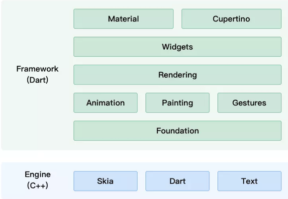
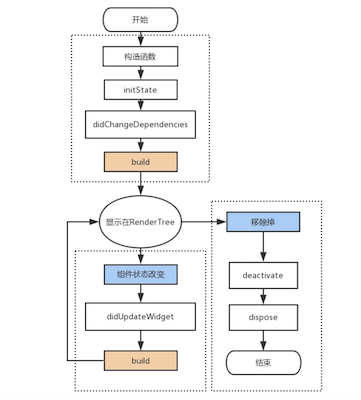
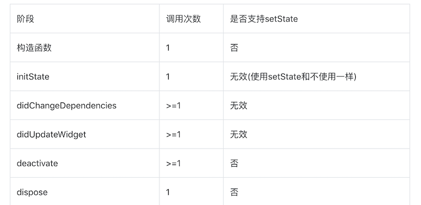

## Flutter

###  Dart简介

+ Dart是由谷歌开发的计算机编程语言,它可以被用于web、服务器、移动应用 和物联网等领域的开发
+ Dart诞生于2011年，号称要取代JavaScript。但是过去的几年中一直不温不火。直到Flutter的出现现在被人们重新重视。
+ 要学Flutter的话我们必须首先得会Dart。

### Flutter简介

+ Flutter 是谷歌公司开发的一款开源、免费的移动 UI 框架，可以让我们快速的在 Android 和iOS 上构建高质量 App。它最大的特点就是跨平台、以及高性能。
+ Flutter 基于谷歌的 dart 语言，如果没有任何 Dart 语言的基础，不建议直接学习 Flutter。建议先学习 Dart 语言的基本语法。然后再进入 Flutter 的学习。

+ 市面上已经有很多的混合 App 开发框架了，但是有些混合 APP 开发框架主要是针对前端开 发者的:比如 ReactNative(基于 React)、Ionic(基于 Angular、Vue、React)。

+ Flutter 是谷歌基于 Dart 语言开发的一款跨平台的移动 App 开发框架。它针对的开发者是全部开发者。它的性能相比 RN、Ionic 这样的框架要好一些，但是现在的手机设备上是看不出 任何区别的。


### 框架设计

Flutter 整体框架是由 Dart 语言来实现的，它的层次非常清晰，每层（模块）的职责也相对单一，整个结构让 Flutter 框架在使用上来说更加容易和学习。框架的底层是 Flutter 引擎，它负责绘图、动画、网络、Dart 运行时等功能，是由 C++ 实现的



+ Framework

  - Material, Cupertino：针对 Android 的 Material 风格，和针对 iOS 的 Cupertino 风格；
  - Widgets：按钮、文本、输入框、图片等组件；
  - Rendering：渲染层，负责布局、绘制、合成等；
  - Animation, Painting, Gestures：动画、绘图、手势；
  - Foundation：最底层，提供上层需要使用的工具类和方法；

+ Engine

  - Skia：图形绘制

    ```
    flutter实现iOS和android的界面的高度一致就是使用了这个跨平台的绘制引擎
    ```

  - Dart：语言运行时

  - Text：纹理

### Skia

+ Skia 是一个 Google 开源的 C++ 二维图形库，提供各种常用的API，并可在多种软硬件平台上运行。
+  谷歌 **Chrome 浏览器**、Chrome OS、**Android 系统**、火狐浏览器、火狐操作系统以及其它许多产品都使用它作为图形引擎。
+ 特别是近两年开始大火的跨平台 App 开发框架 **Flutter**，其图形引擎也是基于 Skia。
+ Skia 在 Chrome 和 Android 上作为底层的**图形引擎**，可以类比为 iOS 上的 **Core Graphic / Core Animation** 一层的框架，可能 Google 并没有大力在上层推广这个框架，所以前端、移动端开发者关注 Skia 并不多。
+ 甚至一些做了多年 Android 开发的同事也不知道有这个东西，也可能跟 Android 系统并没有在 Java 层暴露 Skia 的 API 有关。
+ flutter实现iOS和android的界面的高度一致就是使用了这个跨平台的绘制引擎
+ android底层的图形绘制引擎就是skia


### 布局

#### padding

```dart
Padding(
 padding: EdgeInsets.fromLTRB(10, 10, 0, 0),
 child: Image.network('https://www.itying.com/images/flutter/1.png',
 fit: BoxFit.cover),
)
```

#### row

+ 继承于flex组件，flex布局
+ 主轴是水平方向，侧轴是竖直方向

````dart
Row(
   mainAxisAlignment: MainAxisAlignment.spaceEvenly,    
   crossAxisAlignment: CrossAxisAlignment.start,     //用的比较少
   children: <Widget>[
      IconContainer(Icons.search,color: Colors.blue),
          IconContainer(Icons.home,color: Colors.orange),
          IconContainer(Icons.select_all,color: Colors.red),
        ],
)
````

#### column

+ 继承于flex组件，flex布局

+ 主轴是竖直方向，侧轴是水平方向

  ```dart
  Column(    
          mainAxisAlignment: MainAxisAlignment.spaceEvenly,
          crossAxisAlignment: CrossAxisAlignment.end,   
          children: <Widget>[
            IconContainer(Icons.search,color: Colors.blue),
            IconContainer(Icons.home,color: Colors.orange),
            IconContainer(Icons.select_all,color: Colors.red),
          ],
  ),
  ```


#### Expanded

```dart
Row(    
        children: <Widget>[
          Expanded(
            flex: 1,
            child: IconContainer(Icons.search,color: Colors.blue)
          ),
           Expanded(
            flex: 2,
            child: IconContainer(Icons.home,color: Colors.orange),  
          ),
           Expanded(
            flex: 1,
            child: IconContainer(Icons.select_all,color: Colors.red),  
          ),
               
        ],    
    );

Row(    
        children: <Widget>[
          Expanded(
            flex: 1,
            child: IconContainer(Icons.home,color: Colors.orange),  
          ),
          IconContainer(Icons.search,color: Colors.blue)
        ],    
    );
```

#### stack

+ 层叠组件

##### alignment

```dart
Stack(
        alignment: Alignment.topLeft,
        children: <Widget>[              
          Container(
            height: 400,
            width: 300,
            color: Colors.red,
          ),
          Text('我是一个文本',style: TextStyle(
            fontSize: 40,
            color: Colors.white
          ))           
        ],
      )

Stack(
        alignment: Alignment(1,0.3),
        children: <Widget>[              
          Container(
            height: 400,
            width: 300,
            color: Colors.red,
          ),
          Text('我是一个文本',style: TextStyle(
            fontSize: 20,
            color: Colors.white
          ))           
        ],
      ),
```

##### Align

````dart
Stack(
              children: <Widget>[
                Align(
                  alignment: Alignment(1,-0.2),
                  child: Icon(Icons.home,size: 40,color: Colors.white),
                ),
                Align(
                  alignment: Alignment.center,
                  child: Icon(Icons.search,size: 30,color: Colors.white),
                ),
                Align(
                  alignment: Alignment.bottomRight,
                  child: Icon(Icons.settings_applications,size: 30,color: Colors.white),
                )
              ],
 ),
````

##### Positioned

```dart
Stack(
              children: <Widget>[
                Positioned(
                //  left: 10,
                  child: Icon(Icons.home,size: 40,color: Colors.white),
                ),
                Positioned(
                 bottom: 0,
                 left: 100,
                  child: Icon(Icons.search,size: 30,color: Colors.white),
                ),
                Positioned(
                  right: 0,
                  child: Icon(Icons.settings_applications,size: 30,color: Colors.white),
                )
              ],
   ),
```

### flutter热重载

Flutter的热重载(hot reload)功能可以帮助您在无需重新启动应用的情况下快速、轻松地进行测试、构建用户界面、添加功能以及修复错误。 通过将更新后的源代码文件注入正在运行的Dart虚拟机（VM）中来实现热重载。在虚拟机使用新的的字段和函数更新类后，Flutter框架会自动重新构建widget树，以便您快速查看更改的效果。


编译模式大体可以分为两种，AOT编译与JIT编译。JIT全称是Just In Time，代码可以在程序执行时期编译，因为要在程序执行前进行分析、编译，JIT编译可能会导致程序执行时间较慢；而AOT编译，全称Ahead Of Time，是在程序运行前就已经编译，从开发者修改代码、编译较慢，但运行时不需要进行分析、编译，因此执行速度更快。

Flutter使用了独特的编译模式，开发阶段下，使用Kernel Snapshot模式(对应JIT编译)，将dart代码生成标记化的源代码，运行时编译，解释执行；release阶段，ios使用AOT编译，编译器将dart代码生成汇编代码，最终生成app.framwork，android使用了Core JIT编译，dart转化为二进制模式，在VM启动前载入。

react-native的热重载可以让webpack的增量编译上扯

### flutter的生命周期



- 构造函数

  ```
  这个函数不属于生命周期，因为这个时候State的widget属性为空，如果要在构造函数中访问widget的属性是行不通的。但是构造函数必然是要第一个调用的。
  ```

+ initState

  ```
  当插入渲染树的时候调用，这个函数在生命周期中只调用一次。这里可以做一些初始化工作，比如初始化State的变量。
  ```

+ didChangeDependencies

  ```
  这个函数会紧跟在initState之后调用
  ```

+ didUpdateWidget

  ```
  当组件的状态改变的时候就会调用didUpdateWidget,比如调用了setState.
  实际上这里flutter框架会创建一个新的Widget,绑定本State，并在这个函数中传递老的Widget。
  这个函数一般用于比较新、老Widget，看看哪些属性改变了，并对State做一些调整。
  ```

+ deactivate

  ```
  在dispose之前，会调用这个函数
  ```

+ dispose

  ```
  一旦到这个阶段，组件就要被销毁了，这个函数一般会移除监听，清理环境
  ```



### flutter渲染机制

先按rn的去胡扯吧

### flutter是如何进行Android和iOS原生统一的

- 首先这一层图形绘制引擎，保证了ui的统一性。ui上的交互层保证了操作的统一性
- 将dart语言编译层级对应平台的动态库，猜测应该是针对dart开发了两个编译器前端，生成了各自平台的中间代码。然后利用各自平台的编译器后端，进行汇编，链接，生成动态库

+ 每当项目通过xcode运行时都会执行`xcode_backend.sh`脚本 

  1. 编译dart代码到App.framework中
  2. 编译flutter_assets，并内嵌到App.framework（`BuildApp`所做的事情）
  3. 复制资源，并签名（`EmbedFlutterFrameworks`所做的事情）

  

