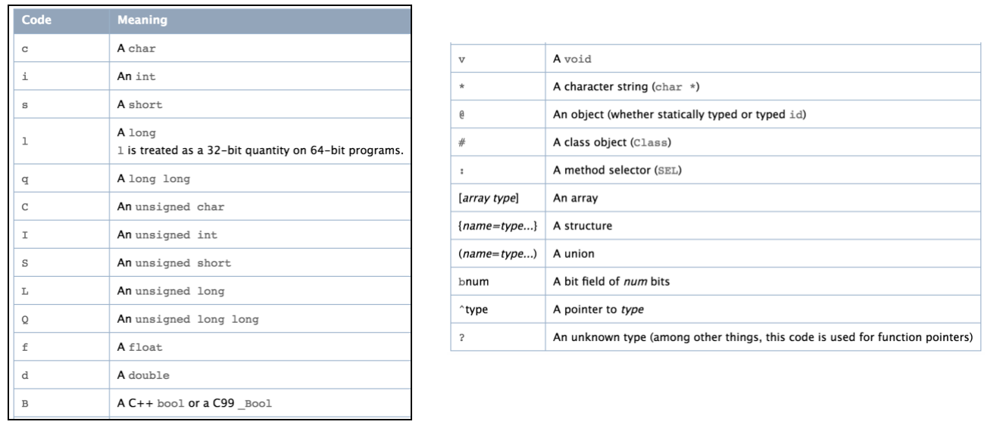

## model解析

+ 根据class_copyPropertyList获取对象的所有属性

  ```objective-c
  - (void)v_setupPropertyAttributesDic {
      if (!objc_getAssociatedObject(self, _cmd)) {
          NSMutableDictionary *propertyAttributesDic = [NSMutableDictionary dictionary];
          unsigned int outCount = 0;
          objc_property_t *propertys = class_copyPropertyList([self class], &outCount);
          for (int i = 0; i < outCount; i++) {
              objc_property_t property_t = propertys[i];
              const char *name = property_getName(property_t);
              const char *attributes = property_getAttributes(property_t);
              NSString *propertyName = [NSString stringWithUTF8String:name];
              NSString *propertyAttributes = [NSString stringWithUTF8String:attributes];
              VModelPropertyAttributes *attributeModel = [[VModelPropertyAttributes alloc] initWithName:propertyName attributeString:propertyAttributes];
              [propertyAttributesDic setObject:attributeModel forKey:propertyName];
          }
          free(propertys);
          if (propertyAttributesDic.count > 0) {
              objc_setAssociatedObject(self, _cmd, propertyAttributesDic, OBJC_ASSOCIATION_RETAIN);
          }
      }
  }
  ```

+ 遍历解析所有属性，得到每个property对应的name，className， encodeType,  objectProtocols

  ```objective-c
  typedef NS_ENUM(NSUInteger, VClassEncodeType) {
      VClassEncodeTypeChar = 1,
      VClassEncodeTypeInt,
      VClassEncodeTypeShort,
      VClassEncodeTypeLong,
      VClassEncodeTypeLongLong,
      VClassEncodeTypeUnsignedChar,
      VClassEncodeTypeUnsignedInt,
      VClassEncodeTypeUnsignedShort,
      VClassEncodeTypeUnsignedLong,
      VClassEncodeTypeUnsignedLongLong,
      VClassEncodeTypeFloat,
      VClassEncodeTypeDouble,
      VClassEncodeTypeBool,
      VClassEncodeTypeVoid,
      VClassEncodeTypeCharString,
      VClassEncodeTypeObject,
      VClassEncodeTypeClass,
      VClassEncodeTypeSEL,
      VClassEncodeTypeArray,
      VClassEncodeTypeStructure,
      VClassEncodeTypeUnion,
      VClassEncodeTypeBit,
      VClassEncodeTypePointer,
      VClassEncodeTypeUnknown
  };
  
  @interface VModelPropertyAttributes : NSObject
  /**
   *  如果属性为对象类型,对象的类名
   */
  @property (nonatomic,strong) NSString *className;
  /**
   *  属性名
   */
  @property (nonatomic,strong,readonly) NSString *name;
  /**
   * 如果属性为对象类型,且遵守协议,对象遵守的协议
   */
  @property (nonatomic,strong) NSArray *objectProtocols;
  /**
   *  属性编码类型
   */
  @property(nonatomic,assign) VClassEncodeType encodeType;
  /**
   *  初始化方法
   *
   *  @param name            属性名
   *  @param attributeString 属性的属性字符串
   */
  - (instancetype)initWithName:(NSString *)name attributeString:(NSString *)attributeString;
  @end
  ```

  ```objc
  #import "VModelPropertyAttributes.h"
  static NSDictionary *encodeTypeMap = nil;
  @interface VModelPropertyAttributes ()
  {
      NSString *propertyName;
  }
  @end
  @implementation VModelPropertyAttributes
  + (NSDictionary *)encodeTypeMap {
      static dispatch_once_t onceToken;
      dispatch_once(&onceToken, ^{
          encodeTypeMap = @{@"c":@1,@"i":@2,@"s":@3,@"l":@4,
                            @"q":@5,@"C":@6,@"I":@7,@"S":@8,
                            @"L":@9,@"Q":@10,@"f":@11,@"d":@12,
                            @"B":@13,@"v":@14,@"*":@15,@"@":@16,
                            @"#":@17,@":":@18,@"[":@19,@"{":@20,
                            @"(":@21,@"b":@22,@"^":@23,@"?":@24};
      });
      return encodeTypeMap;
  }
  
  static NSUInteger extracted(NSMutableArray *protocols) {
      return protocols.count;
  }
  
  - (instancetype)initWithName:(NSString *)name attributeString:(NSString *)attributeString
  {
      self = [super init];
      if (self) {
          [self.class encodeTypeMap];
          propertyName = name;
          NSArray *subAttributeStrings = [attributeString componentsSeparatedByString:@","];
          if ([subAttributeStrings count] > 0) {
              NSString *subAttributeString = [subAttributeStrings firstObject];
              NSScanner *scanner = [NSScanner scannerWithString:subAttributeString];
              [scanner scanUpToString:@"T" intoString:NULL];
              [scanner scanString:@"T" intoString:NULL];
              NSUInteger scanLocation = scanner.scanLocation;
              if (scanLocation < subAttributeString.length) {
                  NSString *encodeType = [subAttributeString substringWithRange:NSMakeRange(scanLocation, 1)];
                  self.encodeType = [[encodeTypeMap objectForKey:encodeType] integerValue];
                  //如果是对象类型
                  if (self.encodeType == VClassEncodeTypeObject) {
                      scanner.scanLocation++;
                      if ([scanner scanString:@"\"" intoString:NULL]) {
                          NSString *className = nil;
                          [scanner scanCharactersFromSet:[NSCharacterSet alphanumericCharacterSet] intoString:&className];
                          //获取类名
                          self.className = className;
                          NSMutableArray *protocols = [NSMutableArray array];
                          while ([scanner scanString:@"<" intoString:NULL]) {
                              NSString *protocolName = nil;
                              [scanner scanUpToString:@">" intoString:&protocolName];
                              if (protocolName) {
                                  //获取协议名
                                  [protocols addObject:protocolName];
                              }
                              [scanner scanString:@">" intoString:NULL];
                          }
                          if (extracted(protocols) > 0) {
                              self.objectProtocols = protocols;
                          }
                      }
                  }
              }
          }
          NSLog(@"==============");
          NSLog(@"attributeString = %@", attributeString);
          NSLog(@"className = %@", _className);
          NSLog(@"objectProtocols = %@", _objectProtocols);
          NSLog(@"name = %@ \n\n ", name);
      }
      return self;
  }
  - (NSString *)name
  {
      return propertyName;
  }
  @end
    
    
  2020-05-07 14:58:05.867 VModel[18714:475977] ==============
  2020-05-07 14:58:05.867 VModel[18714:475977] attributeString = T@"NSString",&,N,V_name
  2020-05-07 14:58:05.867 VModel[18714:475977] className = NSString
  2020-05-07 14:58:05.868 VModel[18714:475977] objectProtocols = (null)
  2020-05-07 14:58:05.868 VModel[18714:475977] name = name 
    
    
  2020-05-07 14:58:05.868 VModel[18714:475977] ==============
  2020-05-07 14:58:05.868 VModel[18714:475977] attributeString = Td,N,V_price
  2020-05-07 14:58:05.868 VModel[18714:475977] className = (null)
  2020-05-07 14:58:05.869 VModel[18714:475977] objectProtocols = (null)
  2020-05-07 14:58:05.869 VModel[18714:475977] name = price 
    
    
  2020-05-07 14:58:05.873 VModel[18714:475977] ==============
  2020-05-07 14:58:05.874 VModel[18714:475977] attributeString = T@"NSArray<Person>",&,N,V_persons
  2020-05-07 14:58:05.874 VModel[18714:475977] className = NSArray
  2020-05-07 14:58:05.875 VModel[18714:475977] objectProtocols = (
      Person
  )
  
  ```

+  根据属性名，在json中获取对应的数据，然后进行解析

  ```objective-c
  #import <objc/runtime.h>
  #import "NSObject+VModel.h"
  #import "VModelPropertyAttributes.h"
  @implementation NSObject (VModel)
  - (instancetype)initVModelWithJSON:(id)json
  {
      self = [self init];
      if (self) {
          [self v_injectWithJSON:json];
      }
      return self;
  }
  
  - (void)v_injectWithJSON:(id)json
  {
      [self v_setupCachedPropertyMapper];
      [self v_setupPropertyAttributesDic];
      [self v_injectJson:json];
  }
  
  - (void)v_setupCachedPropertyMapper {
      if (!objc_getAssociatedObject(self, _cmd)) {
          NSDictionary *dic = [self v_modelPropertyMapper];
          if (dic.count > 0) {
              objc_setAssociatedObject(self, _cmd, dic, OBJC_ASSOCIATION_RETAIN);
          }
      }
  }
  - (void)v_setupPropertyAttributesDic {
      if (!objc_getAssociatedObject(self, _cmd)) {
          NSMutableDictionary *propertyAttributesDic = [NSMutableDictionary dictionary];
          unsigned int outCount = 0;
          objc_property_t *propertys = class_copyPropertyList([self class], &outCount);
          for (int i = 0; i < outCount; i++) {
              objc_property_t property_t = propertys[i];
              const char *name = property_getName(property_t);
              const char *attributes = property_getAttributes(property_t);
              NSString *propertyName = [NSString stringWithUTF8String:name];
              NSString *propertyAttributes = [NSString stringWithUTF8String:attributes];
              VModelPropertyAttributes *attributeModel = [[VModelPropertyAttributes alloc] initWithName:propertyName attributeString:propertyAttributes];
              [propertyAttributesDic setObject:attributeModel forKey:propertyName];
          }
          free(propertys);
          if (propertyAttributesDic.count > 0) {
              objc_setAssociatedObject(self, _cmd, propertyAttributesDic, OBJC_ASSOCIATION_RETAIN);
          }
      }
  }
  - (NSDictionary *)v_modelPropertyMapper
  {
      return @{};
  }
  - (void)v_injectJson:(id)json {
      NSDictionary *propertyMapper = objc_getAssociatedObject(self, @selector(v_setupCachedPropertyMapper));
      NSDictionary *propertyAttributesDic = objc_getAssociatedObject(self, @selector(v_setupPropertyAttributesDic));
      NSArray *attributeModels = [propertyAttributesDic allValues];
      if ([json isKindOfClass:[NSDictionary class]]) {
          for (VModelPropertyAttributes *attributeModel in attributeModels) {
              NSString *propertyName = attributeModel.name;
              NSString *jsonKey = [propertyMapper objectForKey:propertyName];
              jsonKey = jsonKey ?:propertyName;
              id jsonVaule = [json objectForKey:jsonKey];
              id propertyValue = [self v_valueWithAttributeModel:attributeModel withJsonVaule:jsonVaule];
              if (!propertyValue) {
                   propertyValue = attributeModel.encodeType == VClassEncodeTypeObject? nil:@(0);
              }
              [self setValue:propertyValue forKey:propertyName];
          }
      } else if ([json isKindOfClass:[NSArray class]]) {
          VModelPropertyAttributes *attributeModel = attributeModels.firstObject;
          id propertyValue = [self v_valueWithAttributeModel:attributeModel withJsonVaule:json];
          if (!propertyValue) {
              propertyValue = attributeModel.encodeType == VClassEncodeTypeObject? nil:@(0);
          }
          [self setValue:propertyValue forKey:attributeModel.name];
      } else if ([json isKindOfClass:[NSString class]] || [json isKindOfClass:[NSNumber class]]) {
          for (VModelPropertyAttributes *attributeModel in attributeModels) {
              NSString *propertyName = attributeModel.name;
              NSString *jsonKey = [propertyMapper objectForKey:propertyName];
              jsonKey = jsonKey ?:propertyName;
              id jsonVaule = json;
              id propertyValue = [self v_valueWithAttributeModel:attributeModel withJsonVaule:jsonVaule];
              if (!propertyValue) {
                  propertyValue = attributeModel.encodeType == VClassEncodeTypeObject? nil:@(0);
              }
              [self setValue:propertyValue forKey:propertyName];
          }
      }
  }
  - (id)v_valueWithAttributeModel:(VModelPropertyAttributes *)attributeModel withJsonVaule:(id)value {
      id returnValue = nil;
      if (value == nil || [value isKindOfClass:[NSNull class]]) {
          returnValue = nil;
      } else {
          if (attributeModel.encodeType != VClassEncodeTypeObject) {
              if (attributeModel.encodeType == VClassEncodeTypeInt || attributeModel.encodeType == VClassEncodeTypeShort || attributeModel.encodeType == VClassEncodeTypeUnsignedInt || attributeModel.encodeType == VClassEncodeTypeUnsignedShort) {
                  returnValue = [NSNumber numberWithInteger:[value integerValue]];
              } else if (attributeModel.encodeType == VClassEncodeTypeLong || attributeModel.encodeType == VClassEncodeTypeUnsignedLong) {
                  returnValue = [NSNumber numberWithLong:[value longValue]];
              } else if (attributeModel.encodeType == VClassEncodeTypeLongLong || attributeModel.encodeType ==VClassEncodeTypeUnsignedLongLong) {
                  returnValue = [NSNumber numberWithLongLong:[value longLongValue]];
              } else if (attributeModel.encodeType == VClassEncodeTypeFloat) {
                  returnValue = [NSNumber numberWithFloat:[value floatValue]];
              } else if (attributeModel.encodeType == VClassEncodeTypeDouble) {
                  returnValue = [NSNumber numberWithDouble:[value doubleValue]];
              } else if (attributeModel.encodeType == VClassEncodeTypeBool) {
                  returnValue = [NSNumber numberWithBool:[value boolValue]];
              }
          } else {
              NSString *className = attributeModel.className;
              Class class = NSClassFromString(className);
              NSString *protocolName = [attributeModel.objectProtocols firstObject];
              Class protocolClass = NSClassFromString(protocolName);
              if (![className isKindOfClass:[NSDictionary class]] && [value isKindOfClass:[NSDictionary class]]) {
                  returnValue = [[class alloc] initVModelWithJSON:value];
              } else if ([className isKindOfClass:[NSDictionary class]] && [value isKindOfClass:[NSDictionary class]]){
                  returnValue = value;
              } else if ([value isKindOfClass:[NSArray class]] && protocolName == nil){
                  returnValue = value;
              } else if ([value isKindOfClass:[NSArray class]] && protocolName) {
                  NSMutableArray *modelArr = [NSMutableArray array];
                  for (id subValue in value) {
                      if ([subValue isKindOfClass:[NSArray class]]) {
                          [modelArr addObject:[[protocolClass alloc] initVModelWithJSON:subValue]];
                      } else if ([subValue isKindOfClass:[NSDictionary class]]) {
                          [modelArr addObject:[[protocolClass alloc] initVModelWithJSON:subValue]];
                      }
                      returnValue = modelArr;
                  }
              }
              else {
                  if ([class isSubclassOfClass:[NSString class]]) {
                      returnValue = [NSString stringWithFormat:@"%@",value];
                  } else if ([class isSubclassOfClass:[NSNumber class]]) {
                      NSNumberFormatter *numberFormatter = [[NSNumberFormatter alloc] init];
                      [numberFormatter setNumberStyle:NSNumberFormatterDecimalStyle];
                      returnValue = [numberFormatter numberFromString:value];
                  }
              }
          }
      }
      return returnValue;
  }
  @end
  ```

### 总结



1. 首先通过`class_copyPropertyList`获取对象的所有的属性，然后遍历处理所有的属性，得到每个属性对应的name, encodeType, classname, protocols， 包装在VModelPropertyAttributes类型的对象中

   ```objective-c
   如果是对象类型@，classname才有值
   ```

2. 传入json字典，然后遍历遍历所有的属性，然后根据属性name，在json字典中获取对应的data

   1. 假如属性名，跟字典中的对应的key不一样，此时需要提供key的一个映射方法

      ```objective-c
      - (NSDictionary *)v_modelPropertyMapper
      {
          return @{@"carId":@"id"};
      }
      ```

3. 根据data的类型和属性的encodeType， classname，protocols , 来得到属性对应的value。

   1. 假如data是null类型，则返回nil，此时避免了数据中值为null的情况，减少了crash的概率

   2. 假如是非对象类型 `!= VClassEncodeTypeObject` 

      - 简单包装成NSNumber类型返回

   3. 假如是对象类型，根据类名可知具体的类型

      - 假如是 classname != NSDictionary && data == NSDictionary

        - value = [[class alloc] initVModelWithJSON:data]

      - 假如是 classname == NSDictionary && data == NSDictionary

        - value = data;

      - data  == NSArray && protocolName == nil

        - value = data

      - data == NSArray && protocolName

         ```objc
        NSMutableArray *modelArr = [NSMutableArray array];
        Class protocolClass = NSClassFromString(protocolName);
         for (id subData in data) {
                if ([subData isKindOfClass:[NSArray class]]) {
                    [modelArr addObject:[[protocolClass alloc] initVModelWithJSON:subData]];
                 } else if ([subValue isKindOfClass:[NSDictionary class]]) {
                    [modelArr addObject:[[protocolClass alloc] initVModelWithJSON:subData]];
                 }
              value = modelArr;
         }
         ```

4. 最后利用kvc，通过setValue:ForKey: 进行存储

