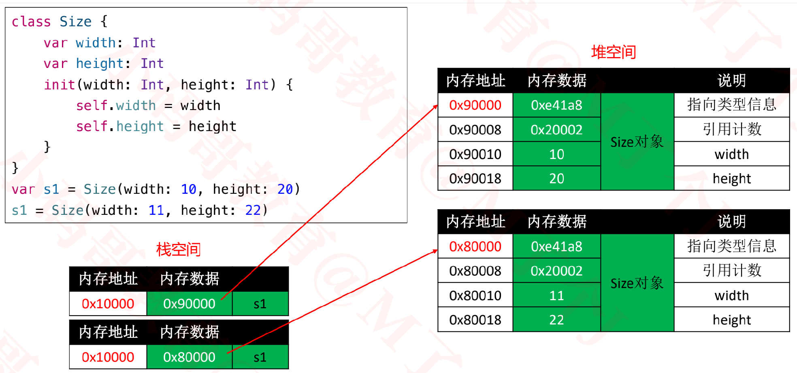
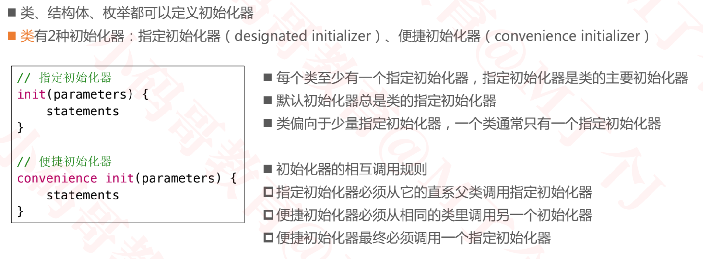
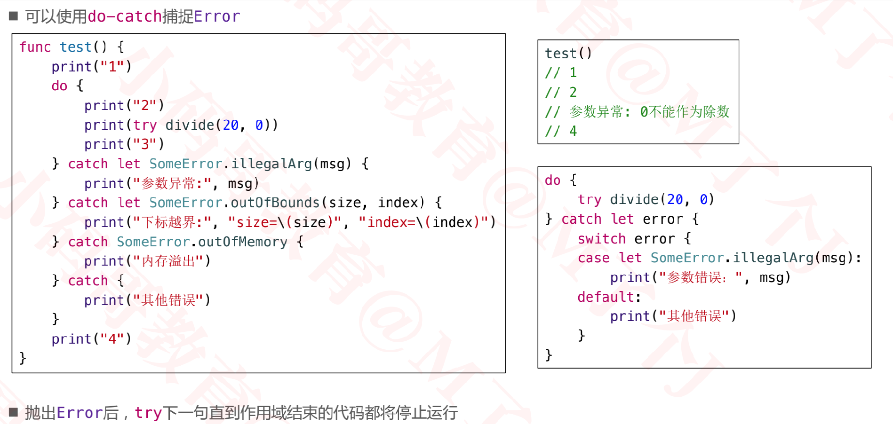

## swift总结

### 常见数据类型


+ 整数类型：Int8、Int16、Int32、Int64、UInt8、UInt16、UInt32、UInt64
+ 将基本的数据类型包装成结构体类型，可以直接调用函数，便于操作

### 枚举

+ 关联值（Associated Values）

  

+ 原始值（Raw Values）

  

### 函数


### 可选项

+ 可选项，一般也叫可选类型，它允许将值设置为nil

+ 在类型名称后面加个问号 ? 来定义一个可选项

  ```swift
  var name: String? = "Jack"
  name = nil
  ```

+ 强制解包（Forced Unwrapping）
  - 如果要从可选项中取出被包装的数据（将盒子里装的东西取出来），需要使用感叹号 ! 进行强制解包

+ 可选项绑定（Optional Binding）

  - 可以使用可选项绑定来判断可选项是否包含值

  - 如果包含就自动解包，把值赋给一个临时的常量(let)或者变量(var)，并返回true，否则返回false

    ```swift
    if let number = Int("123") {
    print("字符串转换整数成功：\(number)")
    // number是强制解包之后的Int值
    // number作用域仅限于这个大括号
    } else {
    print("字符串转换整数失败")
    }
    // 字符串转换整数成功：123
    ```

+ 空合并运算符 ?? 

  ```swift
  let a: Int? = 1
  let c = a ?? 2
  ```

+ **可选项绑定和空合运算符，避免了null指针异常的问题，避免使用强制解包**

### 结构体和类

#### 结构体

+ 所有的结构体都有一个编译器自动生成的初始化器（initializer，初始化方法、构造器、构造方法）

  

+ 编译器会根据情况，可能会为结构体生成多个初始化器，宗旨是：**保证所有成员都有初始值**
  

+ 一旦在定义结构体时**自定义了初始化器**，编译器就不会再帮它自动生成其他初始化器

#### 类

+ 类的定义和结构体类似，但编译器并没有为类自动生成可以传入成员值的初始化器

  

+ 如果类的所有成员都在定义的时候指定了初始值，编译器会为类生成无参的初始化器

  

#### 结构体与类的本质区别

+ 结构体是值类型（枚举也是值类型），类是引用类型（指针类型）

  

#### 值类型


#### 值类型的赋值操作


#### 引用类型


#### 对象的堆空间申请过程


#### 引用类型的赋值操作



#### 枚举、结构体、类都可以定义方法


### 闭包

+ 在Swift中，可以通过func定义一个函数，也可以通过闭包表达式定义一个函数

  

  

### 属性


#### 存储属性


#### 计算属性


#### 延迟属性


#### 延迟属性注意点


### 方法


+ 在func前面加个@discardableResult，可以消除：函数调用后返回值未被使用的警告


### 下标（subscript）


### 继承

+ swift类不会继承一个通用的基类。你定义的类如果没有指定一个父类，那么这个类自动变为当前基类。


+ 被class修饰的类型方法、下标，允许被子类重写
+ 被static修饰的类型方法、下标，不允许被子类重写

### 属性观察器


### 初始化器



#### 初始化器的相互调用


#### 两段式初始化


#### 安全检查


#### 自动继承


+ 用required修饰指定初始化器，表明其所有子类都必须实现该初始化器（通过继承或者重写实现）


### 可选链

+ 多个?可以链接在一起

  - 如果链中任何一个节点是nil，那么整个链就会调用失败

    ```swift
    var price = person?.car?.price // Int?
    ```

    

### 协议（Protocol）

+ 协议可继承，组合

  

+ 协议中的属性

  

  

### Any、AnyObject


### is、as?、as!、as

+ **is**用来判断是否为某种类型，**as**用来做强制类型转换

### X.self、X.Type、AnyClass


### 错误处理

+ do-catch

  

+ try?、try!

  

+ rethrows

  

### 泛型

+ 泛型可以将类型参数化，提高代码复用率，减少代码量

#### 关联类型（Associated Type）


#### 类型约束


### 扩展


#### 与协议的关联


### 访问控制


### OC <一> Swift

+ 在AppDelegate上面默认有个@UIApplicationMain标记，这表示
  - 编译器自动生成入口代码（main函数代码），自动设置AppDelegate为APP的代理

+ Swift调用OC

  - 新建1个桥接头文件，文件名格式默认为：{targetName}-Bridging-Header.h

    ```swift
    @import MJRefresh;
    #import "UIScrollView+PullToRefresh.h"
    ```

+ OC调用Swift

  - Xcode已经默认生成一个用于OC调用Swift的头文件，文件名格式是： {targetName}-Swift.h

    ```swift
    直接将该文件导入到要使用swift api的oc文件中即可
    #import "ClassPlatform_Landi-Swift.h"
    ```

+ Swift、OC桥接转换表

  