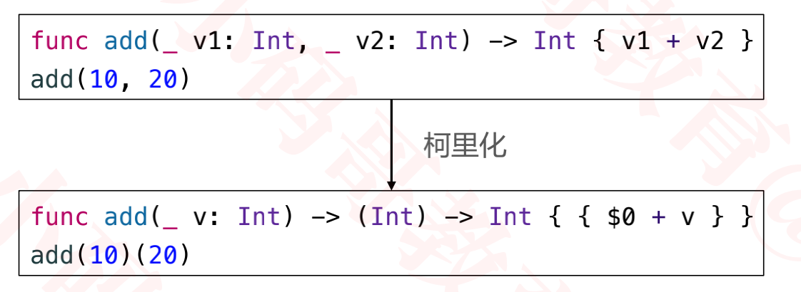
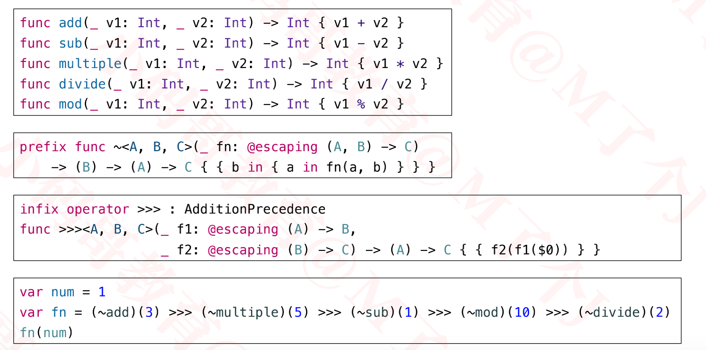

## 函数式编程（Funtional Programming）

+ 函数式编程（Funtional Programming，简称FP）是一种编程范式，也就是如何编写程序的方法论
+ 主要特征：函数是“第一等公民”
  - 函数与其他数据类型一样的地位，可以赋值给其他变量，也可以作为函数参数、函数返回值
+ 函数式编程最早出现在LISP语言，绝大部分的现代编程语言也对函数式编程做了不同程度的支持
  - Haskell、JavaScript、Python、Swift、Kotlin、Scala等
+ 函数式编程中几个常用的概念
  - Higher-Order Function
  - Function Currying
  - Functor
  - Applicative Functo
  - Monad

### 高阶函数（Higher-Order Function）

+ 高阶函数是至少满足下列一个条件的函数
  - 接受一个或多个函数作为输入（map、filter、reduce等）
  - 返回一个函数

### 柯里化（Currying）

- 什么是柯里化？

  - 将一个接受多参数的函数变换为一系列只接受单个参数的函数

  

  

  

+ map

  ```swift
  let array = [5, 4, 3, 1, 2]
  let resultArray = array.map { (item) -> String in
      return "\(item)"
   }
  print(resultArray) // ["5", "4", "3", "2", "1"]
  ```

+ filter

  ```swift
  let array = [5, 4, 3, 1, 2]
  //筛选出大于3的值
  let resultArray = array.filter { (item) -> Bool in
      return item > 3
   }
  print(resultArray) // [5, 4]
  ```

+ reduce

  ```swift
  let array = [5, 4, 3, 1, 2]
  //initalResult: 0
  //nextPartialResult: result
  let result = array.reduce(0) { (result, item) -> Int in
          return result + item
   }
  print(result) // 15
  ```

  