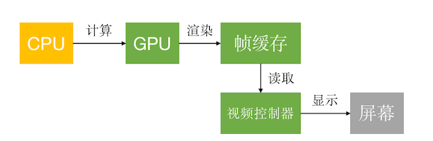
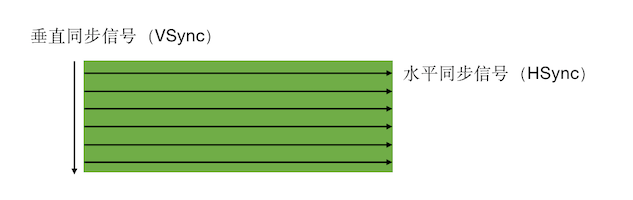
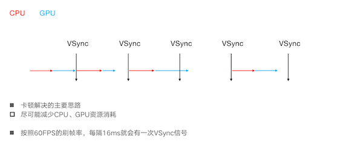
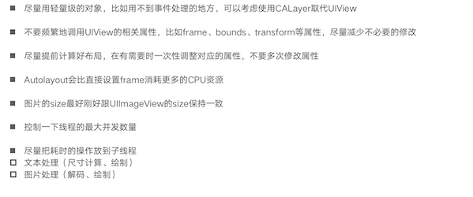
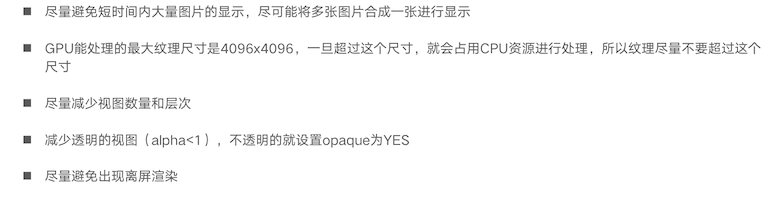
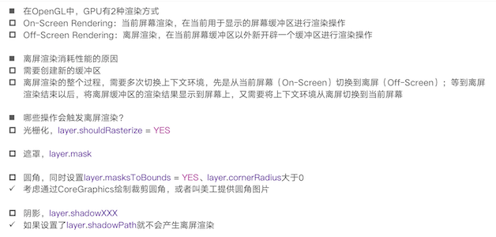

##性能优化

### 卡顿优化

#### CPU和GPU

+ 在屏幕成像的过程中，CPU和GPU起着至关重要的作用

  - CPU（Central Processing Unit，中央处理器）

    - 对象的创建和销毁、对象属性的调整、布局计算、文本的计算和排版、图片的格式转换和解码、图像的绘制（Core Graphics）

  - GPU（Graphics Processing Unit，图形处理器）

    - 纹理的渲染

    

+ 在iOS中是双缓冲机制，有前帧缓存、后帧缓存


#### 屏幕成像原理




#### 卡顿产生原因




#### 卡顿优化 - CPU



#### 卡顿优化 - GPU



#### 离屏渲染



#### 卡顿检测

+ 平时所说的“卡顿”主要是因为在主线程执行了比较耗时的操作

+ 可以添加Observer到主线程RunLoop中，通过监听RunLoop状态切换的耗时，以达到监控卡顿的目的

+ 代码地址: https://github.com/faimin/PerformanceMonitor

+ 参考文章: http://www.tanhao.me/code/151113.html/

+ 界面卡顿是由哪些原因导致的

  - 死锁：主线程拿到锁 A，需要获得锁 B，而同时某个子线程拿了锁 B，需要锁 A，这样相互等待就死锁了。
  - 抢锁：主线程需要访问 DB，而此时某个子线程往 DB 插入大量数据。通常抢锁的体验是偶尔卡一阵子，过会就恢复了。
  - 主线程大量 IO：主线程为了方便直接写入大量数据，会导致界面卡顿。
  - 主线程大量计算：算法不合理，导致主线程某个函数占用大量 CPU。
  - 大量的 UI 绘制：复杂的 UI、图文混排等，带来大量的 UI 绘制。

  ```objc
  #import "PerformanceMonitor.h"
  #import <CrashReporter/CrashReporter.h>
  
  @interface PerformanceMonitor ()
  {
      int timeoutCount;
      CFRunLoopObserverRef observer;
      
      @public
      dispatch_semaphore_t semaphore;
      CFRunLoopActivity activity;
  }
  @end
  
  @implementation PerformanceMonitor
  
  + (instancetype)sharedInstance
  {
      static id instance = nil;
      static dispatch_once_t onceToken;
      dispatch_once(&onceToken, ^{
          instance = [[self alloc] init];
      });
      return instance;
  }
  
  static void runLoopObserverCallBack(CFRunLoopObserverRef observer, CFRunLoopActivity activity, void *info)
  {
      PerformanceMonitor *moniotr = (__bridge PerformanceMonitor*)info;
      
      moniotr->activity = activity;
      
      dispatch_semaphore_t semaphore = moniotr->semaphore;
      dispatch_semaphore_signal(semaphore);
  }
  
  - (void)stopMonitor
  {
      if (!observer)
          return;
      CFRunLoopRemoveObserver(CFRunLoopGetMain(), observer, kCFRunLoopCommonModes);
      CFRelease(observer);
      observer = NULL;
  }
  
  - (void)startMonitor
  {
      if (observer)
          return;
      
      // 信号,Dispatch Semaphore保证同步
      semaphore = dispatch_semaphore_create(0);
      
      // 注册RunLoop状态观察
      CFRunLoopObserverContext context = {0,(__bridge void*)self,NULL,NULL};
      observer = CFRunLoopObserverCreate(kCFAllocatorDefault,
                                         kCFRunLoopAllActivities,
                                         YES,
                                         0,
                                         &runLoopObserverCallBack,
                                         &context);
      //将观察者添加到主线程runloop的common模式下的观察中
      CFRunLoopAddObserver(CFRunLoopGetMain(), observer, kCFRunLoopCommonModes);
      // 在子线程监控时长 开启一个持续的loop用来进行监控observer的activity
      // dispatch_semaphore_wait保证了子线程每50ms检测一次
      // 如果发现连续5次，activity的状态都是kCFRunLoopBeforeSources | kCFRunLoopAfterWaiting
      // 就默认为主线程在该状态持续了250ms，就认为它是卡顿。
      dispatch_async(dispatch_get_global_queue(0, 0), ^{
          while (YES)
          {
              //假定连续5次超时50ms认为卡顿(当然也包含了单次超时250ms)
              //信号量控制，每50ms检测一次当前的activity状态
              long st = dispatch_semaphore_wait(semaphore, dispatch_time(DISPATCH_TIME_NOW, 50*NSEC_PER_MSEC));
              if (st != 0)
              {
                  if (!observer)
                  {
                      timeoutCount = 0;
                      semaphore = 0;
                      activity = 0;
                      return;
                  }
                  //两个runloop的状态，BeforeSources和AfterWaiting这两个状态区间时间能够检测到是否卡顿???
                  if (activity==kCFRunLoopBeforeSources || activity==kCFRunLoopAfterWaiting)
                  {
                      if (++timeoutCount < 5)
                          continue;
                      //timeoutCount == 5时，将当前卡顿的位置上报
                      PLCrashReporterConfig *config = [[PLCrashReporterConfig alloc] initWithSignalHandlerType:PLCrashReporterSignalHandlerTypeBSD
                                                                                         symbolicationStrategy:PLCrashReporterSymbolicationStrategyAll];
                      PLCrashReporter *crashReporter = [[PLCrashReporter alloc] initWithConfiguration:config];
                      NSData *data = [crashReporter generateLiveReport];
                      PLCrashReport *reporter = [[PLCrashReport alloc] initWithData:data error:NULL];
                      NSString *report = [PLCrashReportTextFormatter stringValueForCrashReport:reporter
                                                                                withTextFormat:PLCrashReportTextFormatiOS];
                      //上传服务器
                      NSLog(@"此处发生卡顿:---%@", report);
                  }//end activity
              }// end semaphore wait
            
              //重新计算次数
              timeoutCount = 0;
          }// end while
      });
  }
  
  @end
  
  ```

  

### 耗电优化

#### 耗电的主要来源

- CPU处理，Processing
- 网络，Networking
- 定位，Location
- 图像，Graphics

#### 优化

+ 尽可能降低CPU、GPU功耗
+ 少用定时器
+ 优化I/O操作
  - 尽量不要频繁写入小数据，最好批量一次性写入
  - 读写大量重要数据时，考虑用dispatch_io，其提供了基于GCD的异步操作文件I/O的API。用dispatch_io系统会优化磁盘访问
  - 数据量比较大的，建议使用数据库（比如SQLite、CoreData）
+ 网络优化
  - 减少、压缩网络数据
  - 如果多次请求的结果是相同的，尽量使用缓存
  - 使用断点续传，否则网络不稳定时可能多次传输相同的内容
  - 网络不可用时，不要尝试执行网络请求
  - 让用户可以取消长时间运行或者速度很慢的网络操作，设置合适的超时时间
  - 批量传输，比如，下载视频流时，不要传输很小的数据包，直接下载整个文件或者一大块一大块地下载。如果下载广告，一次性多下载一些，然后再慢慢展示。如果下载电子邮件，一次下载多封，不要一封一封地下载

+ 定位优化
  - 如果只是需要快速确定用户位置，最好用CLLocationManager的requestLocation方法。定位完成后，会自动让定位硬件断电
  - 如果不是导航应用，尽量不要实时更新位置，定位完毕就关掉定位服务
  - 尽量降低定位精度，比如尽量不要使用精度最高的kCLLocationAccuracyBest
  - 需要后台定位时，尽量设置pausesLocationUpdatesAutomatically为YES，如果用户不太可能移动的时候系统会自动暂停位置更新
  - 尽量不要使用startMonitoringSignificantLocationChanges，优先考虑startMonitoringForRegion:
+ 硬件检测优化
  - 用户移动、摇晃、倾斜设备时，会产生动作(motion)事件，这些事件由加速度计、陀螺仪、磁力计等硬件检测。在不需要检测的场合，应该及时关闭这些硬件

### 启动时间优化

#### APP的启动

+ APP的启动可以分为2种
  - 冷启动（Cold Launch）：App 点击启动前，它的进程不在系统里，需要系统新创建一个进程分配给它启动的情况。这是一次完整的启动过程
  - 热启动（Warm Launch）：App 在冷启动后用户将 App 退后台，在 App 的进程还在系统里的情况下，用户重新启动进入 App 的过程，这个过程做的事情非常少

+ APP启动时间的优化，主要是针对冷启动进行优化
+ App 的启动主要包括三个阶段
  1. main() 函数执行前
  2. main() 函数执行后
  3. 首屏渲染完成后
+ 通过添加环境变量可以打印出APP的启动时间分析（Edit scheme -> Run -> Arguments）
  - DYLD_PRINT_STATISTICS设置为1
  - 如果需要更详细的信息，那就将DYLD_PRINT_STATISTICS_DETAILS设置为1

#### main函数执行前

- 加载可执行文件（App 的.o 文件的集合）；

+ 加载动态链接库dyld
+ 执行从dyld开始，dyld从可执行文件的依赖开始, 递归加载所有的依赖动态链接库

+ 加载动态链接库, 进行 rebase 指针调整和 bind 符号绑定

  ```
  recursiveRebase() 由于ASLR的存在，必须递归对主程序以及依赖库进行重定位操作。
  recursiveBind() 把主程序二进制和依赖进来的动态库全部执行符号表绑定。
  
  由于ASLR(address space layout randomization)的存在，可执行文件和动态链接库在虚拟内存中的加载地址每次启动都不固定，所以需要这2步来修复镜像中的资源指针，来指向正确的地址。 rebase修复的是指向当前镜像内部的资源指针； 而bind指向的是镜像外部的资源指针
  ```

+ Objc 运行时的初始处理，包括 Objc 相关类的注册、category合并、selector 唯一性检查等

+ 初始化，包括了执行 +load() 方法、attribute((constructor)) 修饰的函数的调用、创建 C++ 静态全局变量

+ 优化

  - 减少动态库加载。每个库本身都有依赖关系，苹果公司建议使用更少的动态库，并且建议在使用动态库的数量较多时，尽量将多个动态库进行合并。数量上，苹果公司建议最多使用 6 个非系统动态库。
  - 减少加载启动后不会去使用的类或者方法。
  - +load() 方法里的内容可以放到首屏渲染完成后再执行，或使用 +initialize() 方法替换掉。因为，在一个 +load() 方法里，进行运行时方法替换操作会带来 4 毫秒的消耗。不要小看这 4 毫秒，积少成多，执行 +load() 方法对启动速度的影响会越来越大。
  - 控制 C++ 全局变量的数量。

#### main() 函数执行后

+ main() 函数执行后的阶段，指的是从 main() 函数执行开始，到 appDelegate 的 didFinishLaunchingWithOptions 方法里首屏渲染相关方法执行完成

+ 首页的业务代码都是要在这个阶段，也就是首屏渲染前执行的，主要包括了
  - 首屏初始化所需配置文件的读写操作
  - 首屏列表大数据的读取；
  - 首屏渲染的大量计算等
+ 优化
  - 不使用xib，直接视用代码加载首页视图
  - 合并请求等

#### 首屏渲染完成后

+ 首屏渲染后的这个阶段，主要完成的是，非首屏其他业务服务模块的初始化、监听的注册、配置文件的读取等。
+ 这个阶段就是从渲染完成时开始，到 didFinishLaunchingWithOptions 方法作用域结束时结束。
+ 这个阶段用户已经能够看到 App 的首页信息了，所以优化的优先级排在最后。
+ 但是，那些会卡住主线程的方法还是需要最优先处理的，不然还是会影响到用户后面的交互操作。

#### 总结

+ main函数之前

  - 减少动态库、合并一些动态库（定期清理不必要的动态库）
  - 减少Objc类、分类的数量、减少Selector数量（定期清理不必要的类、分类）
  - 减少C++虚函数数量
  - Swift尽量使用struct
  - 用+initialize方法和dispatch_once取代所有的__attribute__((constructor))、C++静态构造器、ObjC的+load

+ main函数之后

  ....


### 安装包瘦身

+ 安装包（IPA）主要由可执行文件、资源组成

+ 资源（图片、音频、视频等）

  1. 采取无损压缩: 对png等图片资源进行无损压缩减少体积

  2. 去除没有用到的资源：通过工具查看工程有有哪些资源没有被使用到，然后删除对应的资源
     -  https://github.com/tinymind/LSUnusedResources

+ 可执行文件瘦身

  - 编译器优化
    - Strip Linked Product、Make Strings Read-Only、Symbols Hidden by Default设置为YES
    - 去掉异常支持，Enable C++ Exceptions、Enable Objective-C Exceptions设置为NO， Other C Flags添加-fno-exceptions
  - 利用AppCode（https://www.jetbrains.com/objc/）检测未使用的代码：菜单栏 -> Code -> Inspect Code
  - 编写LLVM插件检测出重复代码、未被调用的代码