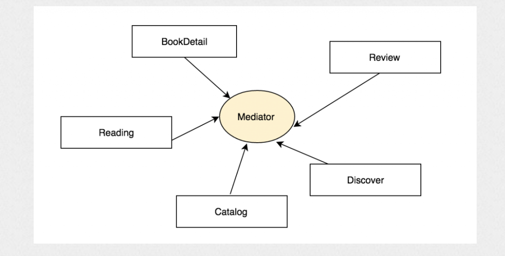

## 模块化

### 为什么要进行模块化?

随着工程越来越大，不同业务之间的相互调用越来越繁杂，并且我们做了好几个app，很多模块功能都是相同的，例如一些基础的网络库，工具库，和一些业务逻辑等等，而且可以把不同的模块组合成一个新的app实现一些定制化需求。这个时候，直接复制代码，因为不同的业务相互调用，造成了极强的耦合性。抽离代码变得十分困难，而且逻辑也不清晰。因此有必要进行模块化。

### 方案的选择?

#### 注册列表的方式

##### 蘑菇街方案原理

1. 注册路由，其内部有个routes字典作为注册表，以url作为key,以注册时传入的handler作为对应的操作

   ```objc
   [MGJRouter registerURLPattern:@"mgj://category/travel" toHandler:^(NSDictionary *routerParameters) {
           [self appendLog:@"匹配到了 url，以下是相关信息"];
           [self appendLog:[NSString stringWithFormat:@"routerParameters:%@", routerParameters]];
           void (^completion)(id result) = routerParameters[MGJRouterParameterCompletion];
           if (completion) {
               completion(@10);
           }
   }];
   //_router中，可以简单理解为保存了@"mgj://category/travel"对应的handler
   
   //routerParameters的值
   //默认的3个key
   //MGJRouterParameterCompletion
   //MGJRouterParameterURL
   //MGJRouterParameterUserInfo
   {
       MGJRouterParameterCompletion = "<__NSGlobalBlock__: 0x1027f4440>";
       MGJRouterParameterURL = "mgj://category/travel";
       MGJRouterParameterUserInfo =     {
           "user_id" = 1900;
       };
   }
   
   ```

2. 通过open，传入url，然后根据url找到对应的handler, 然后往handler中传入参数，调用这个handler

   ```java
    [MGJRouter openURL:@"mgj://category/travel" withUserInfo:@{@"user_id": @1900} completion:^(id result) {
           NSLog(@"result %@", result);//10
       }];
   ```

##### 使用

```objc
//ModuleA.h
@interface ModuleA : NSObject

+ (void)callModelB;

@end
//ModuleA.m
#import "MGJRouter/MGJRouter.h"
@implementation ModuleA
+ (void)callModelB {
    [MGJRouter openURL:@"test://ModuleB/aaa" withUserInfo:@{@"key1":@"123123"} completion:^(id result) {
        NSLog(@"result = %@", result);
    }];
}
@end
  
//ModuleB.h
@interface ModuleB : NSObject

@end
//ModuleB.m
#import "ModuleB.h"
#import "MGJRouter/MGJRouter.h"
@implementation ModuleB
+ (void)load {
    [MGJRouter registerURLPattern:@"test://ModuleB/aaa" toHandler:^(NSDictionary *routerParameters) {
        NSLog(@"routerParameters = %@", routerParameters);
        void (^completion)(id result) = routerParameters[MGJRouterParameterCompletion];
        if (completion) {
            completion(@10);
        }
    }];
}
@end
  
  
//调用
- (BOOL)application:(UIApplication *)application didFinishLaunchingWithOptions:(NSDictionary *)launchOptions {
    // Override point for customization after application launch.
    [ModuleA callModelB];
    return YES;
}

//打印结果
routerParameters = {
    MGJRouterParameterCompletion = "<__NSGlobalBlock__: 0x1095e1328>";
    MGJRouterParameterURL = "test://ModuleB/aaa";
    MGJRouterParameterUserInfo =     {
        key1 = 123123;
    };
}
result = 10
```

+ 从上面可知，我们在ModuleB进行初始化的时候，将其对外界提供的功能注册到注册表中， ModuleB只依赖于路由模块

+ 然后在ModuleA中，通过路由调用ModuleB的功能，ModuleA只依赖于路由模块

+ 路由模块不依赖于ModuleA， ModuleB

+ 因此，总结来说

  1. 当模块加载的时候将模块注册到路由中

  2. 模块之间的通信通过路由模块来进行
  3. 业务模块之间不相互依赖， 业务模块只依赖于路由

##### 缺陷

1. 注册表常驻内存
2. 参数传递限制
3. 调用分散

#### runtime实现路由模块



### 那些方面去思考?

+ 网络方面->方便安全

+ 页面->降低耦合度,降低页面复杂度
+ 本地数据->合理安排，减少性能消耗
+ 如何动态更新内容，以及紧急修复bug
+ 业务方开发的业务模块，以及相关基础模块

### 怎么进行模块化

其核心是 提供网络层，以及工具库，和第三方库作为基础模块，一些通用的封装小部件封装成基础模块， 为其他业务模块提供服务。然后根据业务和功能的不同划分出，BusinessA, BusinessB,BusinessC等等业务模块，为了解决业务模块之间的相互依赖关系，通过一个中间层路由模块提供为各个模块提供通信服务，也就是各个模块只需要依赖这个路由模块就可以调用其他模块。各个模块全部通过cocoapods私有库进行管理。

### 基础模块内部

根据不同的功能进行划分提供网络层服务，以及第三方库，划分为一块

一些工具库，分类等划分在一起

一些通用的跟业务相关的小部件划分在一起

### 路由模块

路由模块的实现的核心是runtime机制。NSInvocation设置target和selector以及参数字典params。降低耦合，同时调用其他模块。

在路由模块内不同的业务对应不同的category,使代码逻辑更加清晰，同时，将不同的category划分为不同的subspec，这样其他业务导入路由的时候，只需要导入自己需要的与其他业务通信的对应的子模块即可。

### 如何处理业务模块和对应的路由子模块之间的关系?

例如有A,B,C,D,E 5个模块，A需要调用B,C模块，此时在A的模块中通过路由来调用对应的B,C模块。对应的路由依赖可以放到A的podspec文件文件中，也可以放到Podfile中。最好是放到Podfile中，这样的话，我们在A进行版本升级的时候，也不需要在podspec文件中修改其依赖的路由模块的版本号，直接在Podfile中修改即可

### 把路由直接通过Podfile定义导入，而不是通过被其他模块依赖导入，有两个好处

1. 可以减少版本升级时，podspec文件的修改量。
2. 如果在一个app中A模块，需要B,C对应的路由模块,在另一个app中A模块，需要C,E对应的路由模块，此时如果放在podspec中就多余了，或者还需要对podspec针对这两个应用划分一下子模块。如果从podfile中导入就完全不存在这个问题了。在模块内部通过if __has_include("xxx.h") 判断对应的路由子模块是否导入。然后通过xxx.h中`#ifndef #define #endif`定义的宏进行对应逻辑的书写。这样也不会因为没有导入B对应的路由子模块而编译不通过。

### 如何进行版本控制?

基础模块，通过创建新的podspec文件，然后在内部指定新的版本号，指定tag或者commit号推送到我们的私有仓库即可。

开发中指定版本号为1.0.0b,然后指定分支为dev,这样大家都能拉到最新开发的代码。但是cocoapods会将我们指定版本号的内容缓存下来，以加快下载，但是这就造成我们拉不到最新的代码。通过一个小脚本，先把对应的缓存清空,和Podfile.lock, Manifest.lock清空，然后再去拉去代码。

更新版本时，每个对应的模块都打tag,然后在主工程中的Podfile文件中写上每个模块对应的版本号，然后再打上tag。

更新时，对每个更新的模块打tag，如果某个模块依赖于这些更新的模块，那么这个模块的的podspec也要更改一个新的版本，并更改它们的podspec， 然后在Podfile填写对应的模块的版本，再对主工程打tag。

### 自己的模块开发时

可以通过:path='module path’指定模块对应的路径，在本地进行开发。


### 去model化设计

组件间调用时，是需要针对参数做去model化的。如果组件间调用不对参数做去model化的设计，就会导致`业务形式上被组件化了，实质上依然没有被独立`。


假设模块A和模块B之间采用model化的方案去调用，那么调用方法时传递的参数就会是一个对象。


如果对象不是一个面向接口的通用对象，那么mediator的参数处理就会非常复杂，因为要区分不同的对象类型。如果mediator不处理参数，直接将对象以范型的方式转交给模块B，那么模块B必然要包含对象类型的声明。假设对象声明放在模块A，那么B和A之间的组件化只是个形式主义。如果对象类型声明放在mediator，那么对于B而言，就不得不依赖mediator。但是，大家可以从上面的架构图中看到，对于响应请求的模块而言，依赖mediator并不是必要条件，因此这种依赖是完全不需要的，这种依赖的存在对于架构整体而言，是一种污染。


如果参数是一个面向接口的对象，那么mediator对于这种参数的处理其实就没必要了，更多的是直接转给响应方的模块。而且接口的定义就不可能放在发起方的模块中了，只能放在mediator中。响应方如果要完成响应，就也必须要依赖mediator，然而前面我已经说过，响应方对于mediator的依赖是不必要的，因此参数其实也并不适合以面向接口的对象的方式去传递。


因此，使用对象化的参数无论是否面向接口，带来的结果就是业务模块形式上是被组件化了，但实质上依然没有被独立。