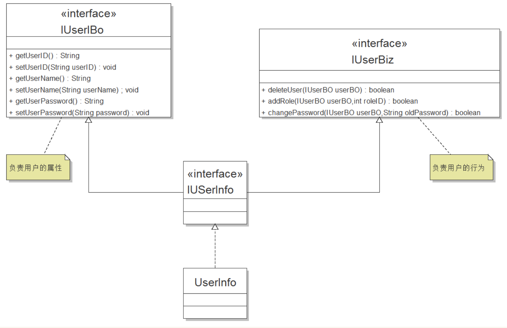

## 设计模式

### 单一职责原则(SRP)

#### 概念

+ 单一职责原则的定义是：应该有且只有一个原因引起类的改变，即一个类只负责一个职责。

  ```
  比如让类C负责两个不同的职责：职责P1，P2。当由于职责P1需求发生改变而需要修改类C时，有可能会导致原本运行正常的职责P2功能发生故障。
  
  假如写一个小游戏，需要游戏的界面和控制游戏的逻辑
  1. 此时我们需要把逻辑放在一个类里，把界面放在一个类里
  2. 这样，当修改逻辑的时候,只需要修改逻辑相关的类。当修改界面时，只需要修改界面相关的类。
  
  假如将界面和逻辑糅合在一起
  1. 此时修改界面或逻辑都需要修改这个类，有可能把其他的逻辑改错。
  ```

#### 示例

+ 关于用户管理的一个类按如下类图来设计：

  

+ 很显然，用户的属性和行为没有分开，按照单一职责原则，应该将其重新拆封成两个接口：用户属性接口IUserBO，用户行为接口IUserBiz

+ 此时类图如下

  

+ 代码实现

  ```java
  ......
  IUserInfo userInfo = new UserInfo();
  // 操作用户的属性
  IUserBo userBo = (IUserBo)userInfo;
  userBo.setPassword("123");
  // 操作用户的行为
  IUserBiz userBiz = (IUserBiz)userInfo;
  userBiz.delete(userBo);
  ......
  ```

#### 总结

+ 单一职责原则适用于接口、类、方法
+ 一个修改密码的方法，就不要把它放在修改用户信息这个类的方法中去，否则方法的职责就不清晰了。
+ 但是过分细分类的职责又会人为的增加系统的复杂性，比如本来一个类可以实现的行为硬拆分为两个类，然后再使用聚合或者组合的方式耦合在一起，就人为的制造了麻烦
+ 由于单一的职责这个“职责”没有一个量化的标准，所以最难划分的还是职责，这个还是要根据实际情况和个人经验来定。

### 开放关闭原则(OCP)

#### 概念

+ 开闭原则的定义是：软件实体（类、模块、方法）应该对扩展开发，对修改关闭。
+ 即当软件需要变化时，尽量通过扩展软件实体的行为来实现变化，而不是通过修改已有的代码来实现变化。
+ 对于不断变化的需求，开闭原则可以保持设计的相对稳定
+ 无论多么封闭，完全的封闭是不可能的
+ 推测可能发生的同一种类型的变化，然后通过抽象来隔离变化
+ 要多做扩展，少做修改，这样可以减少出现问题的概率

#### 示例

+ 书店刚开始卖小说类书籍
+ 后来要求小说类书籍打折处理（40元以上9折，其他8折）
+ 再后来书店增卖计算机类书籍（比小说类书籍多一个属性“类别”）。

##### 书店卖小说

+ 书店刚开始卖小说类书籍的类图如下：

  

+ 代码实现

  ```java
  //书籍接口
  public interface IBook {
      // 书籍名称
      public String getName();
      // 书籍售价
      public int getPrice();
      // 书籍作者
      public String getAuthor();
  }
  
  //小说类
  public class NovelBook implements IBook {
      private String name;
      private int price;
      private String author;
      public NovelBook(String name, int price, String author) {
          this.name = name;
          this.price = price;
          this.author = author;
      }
      @Override
      public String getName() {
          return this.name;
      }
      @Override
      public int getPrice() {
          return this.price;
      }
      @Override
      public String getAuthor() {
          return this.author;
      }
  }
  
  //书店售书类
  public class BookStore {
      private static List<IBook> books = new ArrayList<IBook>();
      // 静态块初始化数据，在类加载时执行一次，先于构造函数
      // 实际项目中一般由持久层完成
      static {
          // 在非金融类项目中对货币的处理一般取两位精度
          // 通常的设计方法是在运算过程中扩大100倍，在显示时再缩小100倍，以减小精度带来的误差
          books.add(new NovelBook("小说A", 3200, "作者A"));
          books.add(new NovelBook("小说B", 5600, "作者B"));
          books.add(new NovelBook("小说C", 3500, "作者C"));
          books.add(new NovelBook("小说D", 4300, "作者D"));
      }
      // 模拟书店卖书
      public static void main(String[] args) {
          // 设置价格精度
          NumberFormat formatter = NumberFormat.getCurrencyInstance();
          formatter.setMaximumFractionDigits(2);
  
          // 展示所有书籍信息
          for (IBook book : books) {
              System.out.println("书籍名称：" + book.getName() + "\t书籍作者"
                      + book.getAuthor() + "\t书籍价格"
                      + formatter.format(book.getPrice() / 100.0) + "元");
          }
      }
  }
  
  //输出结果如下
  书籍名称：小说A    书籍作者作者A    书籍价格￥32.00元
  书籍名称：小说B    书籍作者作者B    书籍价格￥56.00元
  书籍名称：小说C    书籍作者作者C    书籍价格￥35.00元
  书籍名称：小说D    书籍作者作者D    书籍价格￥43.00元
  ```

##### 对小说打折

+ 小说类书籍打折处理（40元以上9折，其他8折）

+ 如果通过修改接口，在接口上新增加一个方法getOffPrice()专门来处理打折书籍，所有实现类实现该方法。那么与IBook接口相关的类都需要修改。

+ 而且作为接口应该是稳定且可靠的，不应经常变化，否则接口作为契约的作用就失去效能了。因此，此方案行不通。

+ 综上，按照OCP原则，应该通过扩展实现变化，增加一个子类OffNovelBook，重写getPrice()方法实现打折处理。

+ 改进后的类图如下：

  

+ 代码实现

  ```java
  //为实现小说打折处理增加的子类
  public class OffNovelBook extends NovelBook {
  
      public OffNovelBook(String name, int price, String author) {
          super(name, price, author);
      }
      // 复写小说价格
      @Override
      public int getPrice() {
          // 获取原价
          int price = super.getPrice();
          // 打折后的处理价
          int offPrice = 0;
          // 如果价格大于40打9折
          if (price > 4000) {
              offPrice = price * 90 / 100;
          } else {
              // 其他打8折
              offPrice = price * 80 / 100;
          }
          return offPrice;
      }
  }
  
  //书店售书类
  public class BookStore {
      private static List<IBook> books = new ArrayList<IBook>();
  
      // 静态块初始化数据，在类加载时执行一次，先于构造函数
      // 实际项目中一般由持久层完成
      static {
          // 在非金融类项目中对货币的处理一般取两位精度
          // 通常的设计方法是在运算过程中扩大100倍，在显示时再缩小100倍，以减小精度带来的误差
          books.add(new OffNovelBook("小说A", 3200, "作者A"));
          books.add(new OffNovelBook("小说B", 5600, "作者B"));
          books.add(new OffNovelBook("小说C", 3500, "作者C"));
          books.add(new OffNovelBook("小说D", 4300, "作者D"));
          // 打折处理后只需更改静态块部分即可
      }
  
      // 模拟书店卖书
      public static void main(String[] args) {
          // 设置价格精度
          NumberFormat formatter = NumberFormat.getCurrencyInstance();
          formatter.setMaximumFractionDigits(2);
  
          // 展示所有书籍信息
          for (IBook book : books) {
              System.out.println("书籍名称：" + book.getName() + "\t书籍作者"
                      + book.getAuthor() + "\t书籍价格"
                      + formatter.format(book.getPrice() / 100.0) + "元");
          }
      }
  }
  //打印的结果
  书籍名称：小说A    书籍作者作者A    书籍价格￥25.60元
  书籍名称：小说B    书籍作者作者B    书籍价格￥50.40元
  书籍名称：小说C    书籍作者作者C    书籍价格￥28.00元
  书籍名称：小说D    书籍作者作者D    书籍价格￥38.70元
  ```

##### 增卖计算机类书籍

+ 书店增卖计算机类书籍（比小说类书籍多一个属性“类别”）

+ 增加一个IComputerBook接口继承IBook接口，增加一个ComputerBook类实现IComputerBook接口即可

+ 其类图如下:

  

+ 修改代码如下

  ```java
  //增加的计算机书籍接口类
  public interface IComputerBook extends IBook {
      // 声明计算机书籍特有的属性-类别
      public String getScope();
  }
  
  //增加的计算机书籍实现类
  public class ComputerBook implements IComputerBook {
      private String name;
      private int price;
      private String author;
      private String scope;
  
      public ComputerBook(String name, int price, String author, String scope) {
          this.name = name;
          this.price = price;
          this.author = author;
          this.scope = scope;
      }
      @Override
      public String getName() {
          return this.name;
      }
      @Override
      public int getPrice() {
          return this.price;
      }
  
      @Override
      public String getAuthor() {
          return this.author;
      }
      @Override
      public String getScope() {
          return this.scope;
      }
  }
  
  //书店售书类
  public class BookStore {
      private static List<IBook> books = new ArrayList<IBook>();
  
      // 静态块初始化数据，在类加载时执行一次，先于构造函数
      // 实际项目中一般由持久层完成
      static {
          // 在非金融类项目中对货币的处理一般取两位精度
          // 通常的设计方法是在运算过程中扩大100倍，在显示时再缩小100倍，以减小精度带来的误差
          books.add(new OffNovelBook("小说A", 3200, "作者A"));
          books.add(new OffNovelBook("小说B", 5600, "作者B"));
          books.add(new OffNovelBook("小说C", 3500, "作者C"));
          books.add(new OffNovelBook("小说D", 4300, "作者D"));
          // 打折处理后只需更改静态块部分即可
  
          // 添加计算机类书籍
          books.add(new ComputerBook("计算机E", 3800, "作者E", "编程"));
          books.add(new ComputerBook("计算机F", 5400, "作者F", "编程"));
      }
  
      // 模拟书店卖书
      public static void main(String[] args) {
          // 设置价格精度
          NumberFormat formatter = NumberFormat.getCurrencyInstance();
          formatter.setMaximumFractionDigits(2);
  
          // 展示所有书籍信息
          for (IBook book : books) {
              System.out.println("书籍名称：" + book.getName() + "\t书籍作者"
                      + book.getAuthor() + "\t书籍价格"
                      + formatter.format(book.getPrice() / 100.0) + "元");
          }
      }
  }
  
  //输出结果
  书籍名称：小说A       书籍作者作者A      书籍价格￥25.60元
  书籍名称：小说B       书籍作者作者B      书籍价格￥50.40元
  书籍名称：小说C       书籍作者作者C      书籍价格￥28.00元
  书籍名称：小说D       书籍作者作者D      书籍价格￥38.70元
  书籍名称：计算机E     书籍作者作者E      书籍价格￥38.00元
  书籍名称：计算机F     书籍作者作者F      书籍价格￥54.00元
  ```

#### 总结

+ 在业务规则改变的情况下，高层模块必须有部分改变以适应新业务，但这种改变是很少的，也防止了变化风险的扩散。
+ 开闭原则对测试是非常有利的，只需要测试增加的类即可。若改动原有的代码实现新功能则需要重新进行大量的测试工作（回归测试等）
+ 开闭原则是面向对象设计中“可复用设计”的基石。
+ 开闭原则是面向对象设计的终极目标，其他原则可以看做是开闭原则的实现方法。

### 里氏替换原则(LSP)

#### 概念

+ 里氏替换原则针对的对象是具有继承关系的子类和父类。
+ 里氏替换原则的定义是：只要父类出现的地方子类就可以出现，而且将其替换为子类也不会产生任何出错或者异常。
+ 子类必须完全实现父类的方法（方法不能为空）。即父类的方法必须是子类全部需要的，如果不是全部需要的，就违背了LSP原则。
+ 在类中调用其他类时必须使用父类或者接口，如果不使用父类或者接口，则类的设计违背了LSP原则。

#### 示例

+ 某公司有普通用户和vip用户，他们发邮件的过程如下：

  

+ 分析发现普通用户和vip用户发邮件的过程是相同的，即两个send()方法重复。将来还可能增加用户新类型，为了让系统具有更好的扩展性，使用里氏替换原则进行重构：

  

#### 总结

+ 子类必须完全实现父类的方法（方法体不为空）；
+ 子类可以有自己特有的方法；

### 接口隔离原则(ISP)

#### 概念

+ 接口隔离原则的定义是：建立单一的接口，不要建立庞大臃肿的接口，尽量细化接口，接口中的方法尽量少。
+ 每个模块应该是单一的接口，提供给几个模块就应该有几个接口，而不是建立一个庞大臃肿的借口来容纳所有客户端访问。
+ 模块依赖的接口不应该有它不需要的方法

#### 示例

##### 示例1

+ 老师类和学生类实现工作的接口类

  

+ 实现代码如下

  ```java
  //工作接口类
  public interface DoWork {
  
      // 学生类要实现的方法
      public void doHomeWork();
  
      // 老师类要实现的方法
      public void correctingHomework(int StudentID);
  
      // 老师类和学生类共同需要实现的方法
      public void attendClass();
  
  }
  
  //老师类实现工作接口
  public class Teacher implements DoWork {
      private int teacherID;
  
      @Override
      public void doHomeWork() {
          // 应该是学生类调用的方法，由于老师类实现了接口DoWork就必须实现接口所有的方法，这里只能为空
      }
  
      @Override
      public void correctingHomework(int StudentID) {
          System.out.println("老师批改作业...");
  
      }
  
      @Override
      public void attendClass() {
          System.out.println("老师开始上课...");
      }
  
  }
  
  //学生类实现工作接口
  public class Student implements DoWork{
      private int studentID;
  
      @Override
      public void doHomeWork() {
          System.out.println("学生做作业...");
      }
  
      @Override
      public void correctingHomework(int StudentID) {
          // 应该是老师类调用的方法，由于学生类实现了接口DoWork就必须实现接口所有的方法，这里只能为空
          
      }
  
      @Override
      public void attendClass() {
          System.out.println("学生开始上课...");
      }
      
  }
  ```

  

+ 老师类其实只需要实现correctingHomework()方法和attendClass()方法
+ 学生类其实只需要实现doHomework()方法和attendClass()方法
+ 但这两个类都有不需要实现的方法在接口中。
+ 由于实现了接口则必须要实现接口中所有的方法，这些不需要的方法的方法体只能为空，显然这不是一种好的设计。

+ 按照接口隔离原则，对该接口进行拆分成3个接口，如下：

  

+ 实现代码

  ```java
  //老师、学生公共接口类
  public interface DoWorkC {
      // 上课
      public void attendClass();
  
  }
  
  //老师接口类
  public interface DoWorkT {
      // 批改作业
      public void correctingHomework(int studentID);
  }
  
  //学生接口类
  public interface DoWorkS {
      // 做作业
      public void doHomeWork();
  }
  
  //老师类实现工作接口
  public class Teacher implements DoWorkT ,DoWorkC{
      private int teacherID;
      @Override
      public void correctingHomework(int StudentID) {
          System.out.println("老师批改作业...");
  
      }
      @Override
      public void attendClass() {
          System.out.println("老师开始上课...");
      }
  }
  
  //学生类实现工作接口
  public class Student implements DoWorkS, DoWorkC {
      private int studentID;
      @Override
      public void doHomeWork() {
          System.out.println("学生做作业...");
      }
      @Override
      public void attendClass() {
          System.out.println("学生开始上课...");
      }
  }
  
  
  ```

##### 示例2

1. 如果有User1, User2, User3三个类，拥有不同的操作权限
2. 定义OPS操作类，如果有op1, op2,op3三个对应的方法，那么对应的用户就拥有了自己不需要的方法或不能拥有的方法
3. 定义 UserOP1,UserOP2, UserOP3三个接口，分别有 对应的op1, op2,op3方法
4. 操作类依赖这三个接口，实现了对应的方法
5. 上述操作，通过接口隔离了不需要的方法

```java
//1. 定义User
class User1 {
  //用户1有操作1
  UserOP1 ops; 
}
class User2 {
  //用户2有操作2
  UserOP2 ops;
}
class User3 {
  //用户3有操作3
  UserOP3 ops;
}

  //2. 定义接口
   interface UserOP1{
       void op1()
   }

   interface UserOP2{
       void op2()
   }

   interface UserOP3{
       void op3()
   }
   //3. 操作类，实现接口
  class OPS: UserOP1, UserOP2, UserOP3 {
       func op1() {}
       func op2() {}
       func op3() {}
  }
```


#### 总结

+ 接口尽量要小；
+ 接口设计是有限度的（接口的设计粒度越小，系统越灵活，但同时也带来了结构的复杂化，导致开发难度增加）
+ 模块依赖的接口不应该有它不需要的方法

### 依赖反转原则(DIP)

#### 概念

+ 依赖倒置原则的定义是：实现类之间不发生直接的依赖关系，其依赖关系是通过接口或者抽象类产生的。即面向接口编程
+ 实现类依赖接口或者抽象类，而接口或者抽象类不依赖于实现类。

#### 示例

##### 示例1

+ 司机开奔驰车的类图如下：

  

+ 实现代码

  ```java
  // 司机的实现类
  public class Driver {
      public void drive(Benz benz) {
          benz.run();
      }
  }
  
  // 奔驰车的实现类
  public class Benz {
      public void run() {
          System.out.println("奔驰车出发...");
      }
  }
  // 场景调用类
  public class Scene {
      public static void main(String[] args) {
          Driver driver = new Driver();
          Benz benz = new Benz();
          driver.drive(benz);
      }
  }
  ```

+ 看起来好像这样设计是没有任何问题的，但我们常说“危难时刻见真情“，在技术上即“变更才显真功夫”。

+ 现在司机不仅要开奔驰，要开宝马车。但司机driver只有开奔驰的方法，而没有开动宝马车的方法啊，这就不合理了

+ 这里只是增加了一个车类就要修改司机类，这是不稳定的、易变的。

+ 引用依赖倒置原则，采用面向接口编程的思想设计类图如下:

  

+ 实现代码如下:

  ```java
  // 司机接口类
  public interface IDriver {
      public void drive(ICar car);
  }
  
  // 汽车接口类
  public interface ICar {
      public void run();
  }
  
  // 司机的实现类
  public class Driver implements IDriver {
      @Override
      public void drive(ICar car) {
          car.run();
      }
  }
  
  // 奔驰车的实现类
  public class Benz implements ICar {
      @Override
      public void run() {
          System.out.println("奔驰车出发...");
      }
  }
  
  // 宝马车的实现类
  public class BMW implements ICar {
      @Override
      public void run() {
          System.out.println("宝马车出发...");
      }
  }
  
  // 场景调用类
  public class Scene {
      public static void main(String[] args) {
          Driver driver = new Driver();
          Benz benz = new Benz();
          BMW bmw = new BMW();
          driver.drive(benz);
          driver.drive(bmw);
      }
  }
  ```

##### 示例2

```java
//1. 定义高层业务模块 
public class Business {
  DatabaseProtocol database;
}
//2. 定义抽象层 
public interface DatabaseProtocol {
   public void add()
   public void delete()
   public void update()
   public void retrieve()
 }
//3. 数据库模块  
public class Ream: DatabaseProtocol {
   void add() {
     
   }
   void delete() {
     
   }
   void update() {
     
   }
   void retrieve() {
     
   }
}
//4. 外部使用业务模块 
Business business =  new Business()
business.database  = new Realm()
       
//此时业务模块和数据库模块完全解耦，
//当我们替换数据库模块时，对业务层模块没有任何影响
```


#### 总结

+ 依赖倒置原则的本质就是通过抽象（接口或抽象类）使各个类或模块的实现彼此独立，不相互影响，实现模块间的松耦合。
+ 依赖倒置原则使类或模块之间不存在依赖关系，可以进行独立的并行开发，而且两个类的单元测试也可以独立地运行。
+ 变量的表面类型尽量是接口或者抽象类

### 迪米特法则(LOD)

#### 概念

+ 迪米特法则又称最少知道原则
+ 一个对象应该对其他对象有最少的理解，即一个类应该对自己需要耦合或需要调用的类知道的最少。

#### 示例

#####  例A：一个类只能和朋友类交流

+ 朋友类是这样定义的：出现在成员变量、方法的输入参数中的类称为朋友类，出现在方法体内的类不能称为朋友类。

+ 老师让班长清点全班人数的类图如下

  

+ 代码实现如下

  ```java
  public class Teacher {
      // 老师下发命令让班长清点学生人数
      public void commond(Monitor monitor) {
          // 初始化学生数量
          List<Student> students = new ArrayList<Student>();
          for (int i = 0; i < 30; i++) {
              students.add(new Student());
          }
          //通知班长开始清点人数
          monitor.countStudents(students);
      }
  }
  
  public class Monitor {
      // 清点学生人数
      public void countStudents(List<Student> students) {
          System.out.println("学生数量是" + students.size());
      }
  }
  
  public class Student {
  
  }
  
  //场景调用类
  public class Scene {
  
      public static void main(String[] args) {
          Teacher teacher = new Teacher();
          teacher.commond(new Monitor());
      }
  
  }
  ```

+ 上例中的Teacher类与Student类不是朋友类，却与一个陌生类Student有了交流，这是违反了迪米特法则(LOD)的。

+ 将`List<Student>`初始化操作移动到场景类中，同时在Monitor类中注入`List<Student>`，避免Teacher类对Student类（陌生类）的访问。改进后的类图如下：

  

+ 新的实现代码如下

  ```java
  public class Teacher {
      public void commond(Monitor monitor) {
          // 通知班长开始清点人数
          monitor.countStudents();
      }
  
  }
  
  public class Monitor {
      private List<Student> students;
      // 构造函数注入
      public Monitor(List<Student> students) {
          this.students = students;
      }
      // 清点学生人数
      public void countStudents() {
          System.out.println("学生数量是" + students.size());
      }
  
  }
  
  public class Student {
  
  }
  
  //场景调用类
  public class Scene {
  
      public static void main(String[] args) {
          // 初始化学生数量
          List<Student> students = new ArrayList<Student>();
          for (int i = 0; i < 30; i++) {
              students.add(new Student());
          }
          // 老师下发命令让班长清点学生人数
          Teacher teacher = new Teacher();
          teacher.commond(new Monitor(students));
      }
  
  }
  ```

##### 例B：类与类之间的交流也是有距离的

+ 模拟软件安装的向导：第一步，第二步（根据第一步判断是否进行），第三步（根据第二步判断是否进行）...，其类图如下：

  

+ 实现代码如下:

  ```java
  //安装向导类
  public class Wizard {
      // 产生随机数模拟用户的不同选择
      private Random rand = new Random();
      // 第一步
      public int first() {
          System.out.println("安装第一步...");
          // 返回0-99之间的随机数
          return rand.nextInt(100);
      }
      // 第二步
      public int second() {
          System.out.println("安装第二步...");
          return rand.nextInt(100);
      }
      // 第三步
      public int third() {
          System.out.println("安装第三步...");
          return rand.nextInt(100);
      }
  }
  //安装类
  public class InstallSoftware {
      public void installWizard(Wizard wizard) {
          int first = wizard.first();
          // 根据第一步返回的数值判断是否执行第二步
          if (first > 50) {
              int second = wizard.second();
              if (second < 50) {
                  int third = wizard.third();
              }
          }
      }
  }
  //场景调用类
  public class Scene {
  
      public static void main(String[] args) {
          InstallSoftware install = new InstallSoftware();
          install.installWizard(new Wizard());
      }
  
  }
  ```

+ 上例的Wizard类把太多的方法暴露给InstallSoftware类，耦合关系变得异常牢固。

+ 如果将Wizard类中的first方法的返回类型由int更改为boolean，随之就需要更改InstallSoftware类了，从而把修改变更的风险扩散开了。

  ```
  因此一个类应该对要调用的类知道的尽量的少
  ```

+ 根据迪米特法则(LOD)，将Wizard类中的3个public方法修改为private方法，对安装过程封装在一个对外开放的InstallWizard方法中。

  ```
  根据迪米特法则，一个类应该对自己所调用的类知道的尽量少。
  因此将Wizard的3个public方法修改为private方法
  ```

+ 对设计进行重构后的类图如下：

  

+ 代码实现如下:

  ```java
  //安装向导类
  public class Wizard {
      // 产生随机数模拟用户的不同选择
      private Random rand = new Random();
      // 第一步
      private int first() {
          System.out.println("安装第一步...");
          // 返回0-99之间的随机数
          return rand.nextInt(100);
      }
      // 第二步
      private int second() {
          System.out.println("安装第二步...");
          return rand.nextInt(100);
      }
      // 第三步
      private int third() {
          System.out.println("安装第三步...");
          return rand.nextInt(100);
      }
      //对私有方法进行封装，只对外开放这一个方法
      public void installWizard(){
          int first = this.first();
          // 根据第一步返回的数值判断是否执行第二步
          if (first > 50) {
              int second = this.second();
              if (second < 50) {
                  int third = this.third();
              }
          }
      }
  
  }
  
  //安装类
  public class InstallSoftware {
  
      public void installWizard(Wizard wizard) {
          // 直接调用
          wizard.installWizard();
      }
  
  }
  
  //场景调用类
  public class Scene {
  
      public static void main(String[] args) {
          InstallSoftware install = new InstallSoftware();
          install.installWizard(new Wizard());
      }
  
  }
  ```

+ 通过这样重构后，类之间的耦合关系变弱。
+ Wizard类只对外公布了一个public方法，即使要修改first()的返回值，影响的也仅仅是Wizard一个类本身，其他类不受任何影响，这体现了该类的高内聚特性。

#### 总结

+ 一个类不要访问陌生类（非朋友类），这样可以降低系统间的耦合，提高了系统的健壮性。
+ 在设计类时应该尽量减少使用public的属性和方法，考虑是否可以修改为private，default，protected等访问权限，是否可以加上final等关键字。
+ 一个类公开的public方法越多，修改时涉及的面也就越大，变更引起的风险扩散也就越大。

### 单例

+ https://blog.csdn.net/afei__/article/details/80413195

### 代理模式

+ https://blog.csdn.net/afei__/article/details/80555456

### 工厂方法模式

+ https://blog.csdn.net/afei__/article/details/80462003

### 抽象工厂模式

+ https://blog.csdn.net/afei__/article/details/80467969

### 观察者模式

+ https://blog.csdn.net/afei__/article/details/80718809

### 中介者模式

+ https://blog.csdn.net/afei__/article/details/80638385

### 适配器

+ https://blog.csdn.net/afei__/article/details/80712914

### 桥接

+ https://blog.csdn.net/afei__/article/details/80781679

### 观察者模式

+ https://blog.csdn.net/afei__/article/details/80718809

### 命令

+ https://blog.csdn.net/afei__/article/details/80660129

### 参考

+ [6大设计原则详解1](https://www.cnblogs.com/LangZXG/p/6242925.html)
+ [6大设计原则详解2](https://www.cnblogs.com/LangZXG/p/6242927.html)
+ [设计模式分类以及六大设计原则](https://blog.csdn.net/afei__/article/details/80412746)

