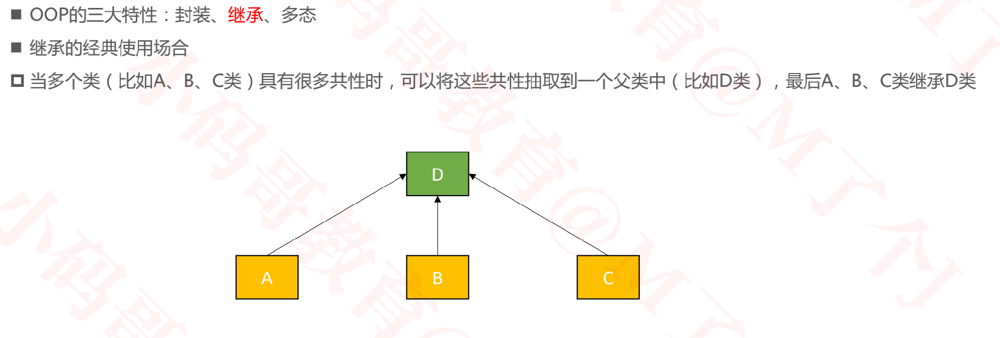

## 面向协议编程
### 基本概念


### 回顾OOP



### OOP的不足


### POP的解决方案

将统一的行为(实现)放到协议中


### POP的注意点

+ **优先考虑创建协议**，而不是父类（基类）

  ```
  时刻记住使用协议解决问题
  ```

+ 优先考虑**值类型（struct、enum）**，而不是引用类型（class）

  ```
  使用值类型，能够迫使我们必须使用协议来统一行为。而不是使用类的继承结构
  ```

+ **巧用协议的扩展功能**

  ```
  使用协议的扩展功能:
  1. 扩展协议的功能
  2. 为协议中的方法或属性，提供默认实现
  ```

+ 引用类型(类 class),值类型(struct , enum)都可以遵守协议

+ 不要为了面向协议而使用协议

### 使用协议实现前缀效果

+ 使用前缀来扩展，将扩展的方法与系统的或其他人的扩展的方法隔离开

+ 给String扩展一个MJ属性

  ```swift
  struct MJ {
      let str:String
      init(_ str: String) {
          self.str = str
      }
  }
  extension String {
      //给String扩展两个计算属性, 计算属性相当于方法调用, String并不持有mj属性
      //返回MJ类型对应的实例变量
      var mj:MJ {
          return MJ(self)
      }
      //返回MJ类型本身
      static var mj:MJ.Type {
        return MJ.self
      }
  }
  extension MJ {
      //MJ扩展方法, 为了给字符串使用
      func instanceMethodForString()  {
          print("instanceMethodForString \(str)")
      }
      static func classMethodForString()  {
          print("classMethodForString")
      }
  }
  
  func test() {
     //通过为String扩展mj属性
     //然后为MJ结构体扩展对应的方法
     //String通过mj来调用这个方法
     "123".mj.instanceMethodForString()
      String.mj.classMethodForString()
  
  
  }
  //打印结果为
  instanceMethodForString "123"
  classMethodForString 
  ```

+ 同理给自定义的Person类扩展一个MJ属性

  ```swift
  struct MJ {
      let person: Person
      init(_ person:Person) {
          self.person = person
      }
  }
  
  //为自定义的Person扩展MJ属性
  class Person {}
  extension Person {
      //计算属性相当于方法调用, Person并不持有mj属性，不会循环引用
      var mj:MJ {
          return MJ(self)
      }
      static var mj:MJ.Type {
          return MJ.self
      }
  }
  extension MJ {
      //MJ扩展方法, 为了给Person使用
      func instanceMethodForPerson()  {
          print("instanceMethodForPerson")
      }
      static func classMethodForPerson()  {
          print("classMethodForPerson")
      }
  }
  ```

+ 上面的缺陷是MJ结构虽然是一样的，但是不能复用，因为传入的类型不同， 所以可以考虑使用泛型。对于String, Person通过MJ扩展的方法只希望对应的类型能使用，因此对MJ进行扩展时可以使用 where进行限制。因此对上面的结构进行优化后，如下

  ```swift
  struct MJ<Base> {
      let base:Base
      init(_ base: Base) {
          self.base = base
      }
  }
  
  extension String {
      //MJ内部使用泛型
      var mj:MJ<String> {
          return MJ(self)
      }
      static var mj:MJ<String>.Type {
          return MJ.self
      }
  }
  //Base == String ， String是结构体
  extension MJ where Base == String {
      //针对String扩展的方法
      func instanceMethodForString()  {
          print("instanceMethodForString \(self.base)")
      }
      static func classMethodForString()  {
          print("classMethodForString")
      }
  }
  
  class Person {}
  
  extension Person {
      var mj:MJ<Person> {
          return MJ(self)
      }
      static var mj:MJ<Person>.Type {
          return MJ.self
      }
  }
  
  //扩展MJ
  //Base == Person 代表针对Person的扩展
  //Base:Person 代表针对Person及其子类的扩展
  extension MJ where Base == Person {
      //针对Person扩展的方法
      func instanceMethodForPerson()  {
          print("instanceMethodForPerson \(self.base)")
      }
      static func classMethodForPerson()  {
          print("classMethodForPerson")
      }
  }
  ```

+ 在String和Person中分别扩展了两个属性mj, 这部分功能是一样的，可以用Protocol把这部分功能抽离出来, **将MJ属性定义在协议的扩展中，提供了默认实现，这样所有遵守该协议的类型都具有了rx属性**

  ```swift
  struct MJ<Base> {
      let base:Base
      init(_ base: Base) {
          self.base = base
      }
  }
  protocol MJCompatible {
     // 可省略
     // associatedtype MJBase
     // static var mj: MJ<MJBase>.Type { get  }
     // var mj: MJ<MJBase> { get }
  }
  
  extension MJCompatible {
      //将MJ属性定义在协议的扩展中，提供了默认实现，这样所有遵守该协议的类型都具有了rx属性
      var mj:MJ<Self> {
          return MJ(self)
      }
      static var mj:MJ<Self>.Type {
          return MJ.self
      }
  }
  extension String:MJCompatible {}
  
  
  class Person {}
  
  extension Person:MJCompatible {}
  
  extension MJ where Base == Person {
      func instanceMethodForPerson()  {
          print("instanceMethodForPerson \(self.base)")
      }
      static func classMethodForPerson()  {
          print("classMethodForPerson")
      }
  }
  
  extension MJ where Base == String {
      func instanceMethodForString()  {
          print("instanceMethodForString \(self.base)")
      }
      static func classMethodForString()  {
          print("classMethodForString")
      }
  }
  ```

+ 如果在MJ中扩展一个mutating方法, 则要求mj不能是只读的计算属性

  ```swift
  //结构体和枚举是值类型，默认情况下，值类型不能被自身的实例方法修改
  //对于结构体和枚举，通过在实例方法之前放在`mutating`关键字，将这个方法变异，从而可以修改属性
  protocol MJCompatible {
     // 可省略
     // associatedtype MJBase
     // static var mj: MJ<MJBase>.Type { set get }
     // var mj: MJ<MJBase> { set get }
  }
  
  extension MJCompatible {
      //此时mj不是一个只读的计算属性
      var mj:MJ<Self> {
        set {}
        get {return MJ(self)}
      }
      static var mj:MJ<Self>.Type {
         set {}
         get {return MJ.self}
      }
  }
  
  extension MJ where Base == String {
      func instanceMethodForString()  {
          print("instanceMethodForString \(self.base)")
      }
      static func classMethodForString()  {
          print("classMethodForString")
      }
      
      mutating func run() { //要求协议中的mj不能是只读属性
  
      }
  }
  
  func test() {
    var str = "123123";
    str.mj.run()//此时能够调用成功
    //"1231231".mj.run() 这种调用是错误的
  }
  ```

+ 最终的效果

  ```swift
  struct MJ<Base> {
      var base:Base
      init(_ base: Base) {
          self.base = base
      }
  }
  
  protocol MJCompatible {
      associatedtype MJBase
      static var mj: MJ<MJBase>.Type {  set get  }
      var mj: MJ<MJBase> { set get }
  }
  extension MJCompatible {
      var mj:MJ<Self> {
          set {}
          get {return MJ(self)}
      }
      static var mj:MJ<Self>.Type {
          set {}
          get {return MJ.self}
      }
  }
  
  //String
  extension String:MJCompatible {}
  extension MJ where Base == String {
      func instanceMethodForString()  {
          print("instanceMethodForString \(self.base)")
      }
      static func classMethodForString()  {
          print("classMethodForString")
      }
      mutating func run() { //要求协议中的mj不能是只读属性
  
      }
  }
  
  //Person
  class Person {}
  extension Person:MJCompatible {}
  extension MJ where Base == Person {
      func instanceMethodForPerson()  {
          print("instanceMethodForPerson \(self.base)")
      }
      static func classMethodForPerson()  {
          print("classMethodForPerson")
      }
  }
  
  ```


### 为String, NSString, NSMutableString统一扩展方法

+ String和NSString是可以相互桥接的

+ 它们都遵守 ExpressibleByStringLiteral协议,所以利用前缀扩展如下

  ```swift
  extension String: MJCompatible {}
  extension NSString: MJCompatible {}
  extension MJ where Base: ExpressibleByStringLiteral {
  func numberCount() -> Int {
    let string = base as! String
    var count = 0
    for c in string where ("0"..."9").contains(c) {
    count += 1
    }
    return count
    }
  }
  ```

### 利用协议实现类型判断

```swift
protocol ArrayType {}
extension Array: ArrayType {}
extension NSArray: ArrayType {}
func isArrayType(_ type: Any.Type) -> Bool { 
  //当某个类型遵守了协议，之后它同时也是协议类型。 协议也可以理解为像struct, enum, class一样具有Type
  type is ArrayType.Type 
}
isArrayType([Int].self) //true
isArrayType([Any].self) //true
isArrayType(NSArray.self) //true
isArrayType(NSMutableArray.self) //true


func isArray(_ value: Any) -> Bool { value is [Any] }
isArray( [1, 2] ) //true
isArray( ["1", 2] ) //true
isArray( NSArray() ) //true
isArray( NSMutableArray() ) //false
```

### 与RxSwift相关

#### 实现rx前缀效果

```swift
public struct Reactive<Base> {
    public let base: Base
    public init(_ base: Base) {
        self.base = base
    }
}

public protocol ReactiveCompatible {
    associatedtype ReactiveBase
    static var rx: Reactive<ReactiveBase>.Type { get set }
    var rx: Reactive<ReactiveBase> { get set }
}

extension ReactiveCompatible {
    /// Reactive extensions.
    public static var rx: Reactive<Self>.Type {
        get {return Reactive<Self>.self}
        set {}
    }
    public var rx: Reactive<Self> {
        get {return Reactive(self)}
        set {}
    }
}

// 万物皆rx
extension NSObject: ReactiveCompatible { }

extension Reactive where Base: UIView {
    public var isHidden: Binder<Bool> {
        return Binder(self.base) { view, hidden in
            view.isHidden = hidden
        }
    }
    /// Bindable sink for `alpha` property.
    public var alpha: Binder<CGFloat> {
        return Binder(self.base) { view, alpha in
            view.alpha = alpha
        }
    }
    ....
    ....
}
```

#### 为某个控件扩展计算属性

```swift

public struct Binder<Value>: ObserverType {
    public typealias Element = Value
    
    private let _binding: (Event<Value>) -> Void
    
    public init<Target: AnyObject>(_ target: Target, scheduler: ImmediateSchedulerType = MainScheduler(), binding: @escaping (Target, Value) -> Void) {//binding逃逸闭包
        weak var weakTarget = target
        self._binding = { event in
            switch event {
            case .next(let element):
                _ = scheduler.schedule(element) { element in
                    if let target = weakTarget {
                        binding(target, element)
                    }
                    return Disposables.create()
                }
            case .error(let error):
                bindingError(error)
            case .completed:
                break
            }
        }
    }
    public func on(_ event: Event<Value>) {
        self._binding(event)
    }
}

extension Reactive where Base: OSTitleView {
    //observer:当观察到数据后rxTitle这个Observer调用on方法,从而调用 binding(target, element)
    var rxTitle: Binder<String> {
        //self.base 即为OSTitleView实例变量, 即为target
        //rxTitle即为流动过来的数据
        //
        return Binder(self.base){target,rxTitle in
            target.titleLab.text = rxTitle//这是一个逃逸闭包
        }
    }
}
//使用
let titleObservable =  Observable<String>.create { (observer) -> Disposable in
        observer.onNext("消耗记录")
        return Disposables.create()
}
let titleView =  OSTitleView()
//titleView.rx为Reactive实例,Reactive实例中的self.base即为titleView。
let observer = titleView.rx.rxTitle
titleObservable.bind(to: observer).disposed(by: disposeBag)
```

### 总结

1. 协议用来统一行为, 隔离变化。

   ```
   例如， 定义一个UI协议，将UI界面与业务的交互抽离出来作为协议，统一成UI界面的行为。同时隔离了UI界面的变化，UI界面无论怎么变，只要业务逻辑不变，那么我们的业务层，协议层，以及Controller层都是完全复用的。
   ```

2. 可以通过extension来进行协议扩展，以及在协议中做一些默认实现，这样只要遵循这个协议，就默认拥有了这些实现。 也同时实现了可选协议的功能。在`extension 协议`中实现的方法，相当于可选的方法，这些方法在遵循这个协议的结构中就不需要强制实现了

   ```swift
   protocol CustomProtocol {
       func test()  //遵循这个协议的结构，必须实现该方法
       func test2()
   }
   extension CustomProtocol {
       //遵循这个协议，可以直接调用这个方法实现
       func log() { 
           print("12312312")
       }
       //提供一个默认实现，遵循这个协议的结构就不必一定要实现这个方法了，达到了协议中定义可选方法的目的
       func test2() {
         
       }
   }
   
   extension UIViewController: CustomProtocol {
       //必须实现这个方法
       func test() {
       }
       //如果不实现这个方法，就会使用在 extension CustomProtocol中的默认实现
       //如果实现这个方法，就会覆盖在 extension CustomProtocol中的默认实现
       func log() {
           print("2312312")
       }    
   }
   class ViewController: UIViewController {
       override func viewDidLoad() {
           super.viewDidLoad()
           self.log()
           self.test()
           self.test2()
       }
   }
   ```
   
3. 在协议中提供默认的变量的实现，实现前缀效果

